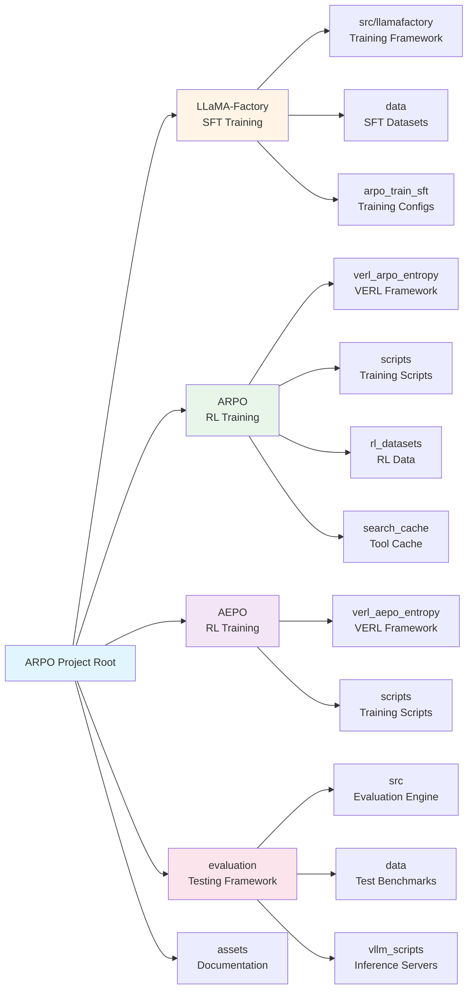
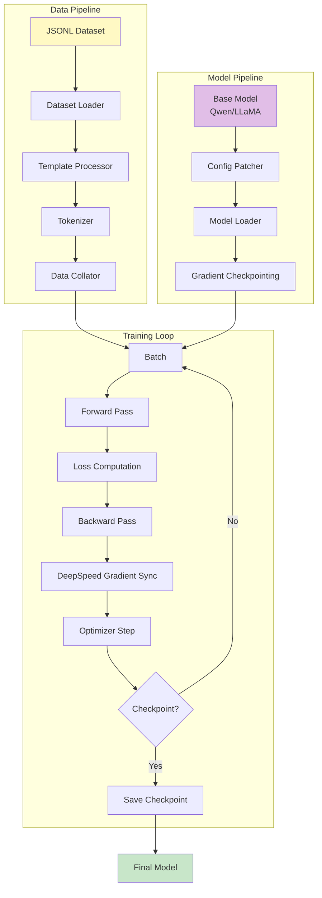
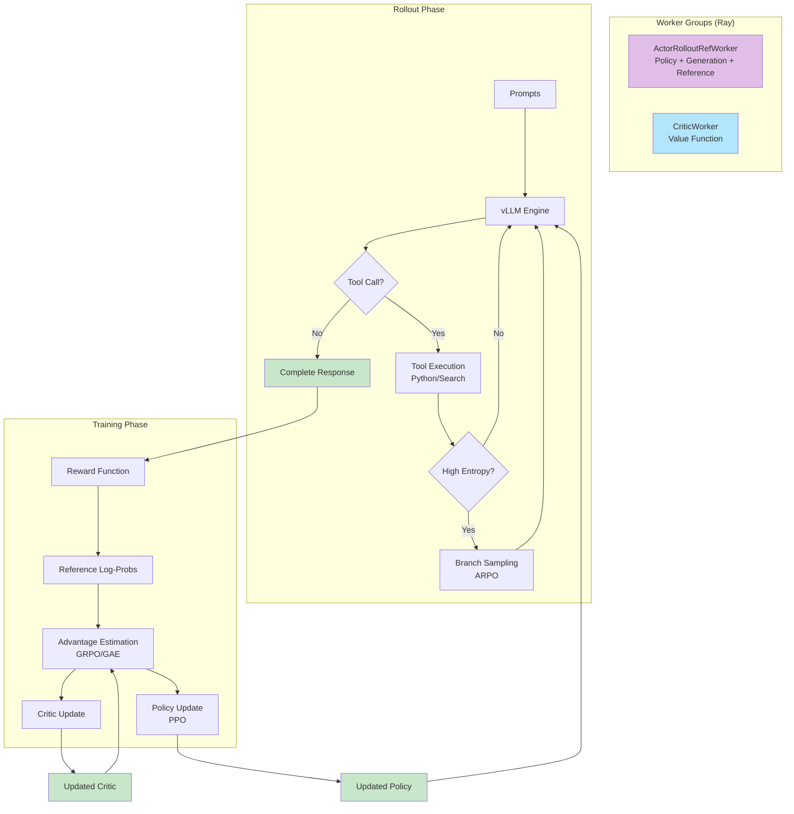
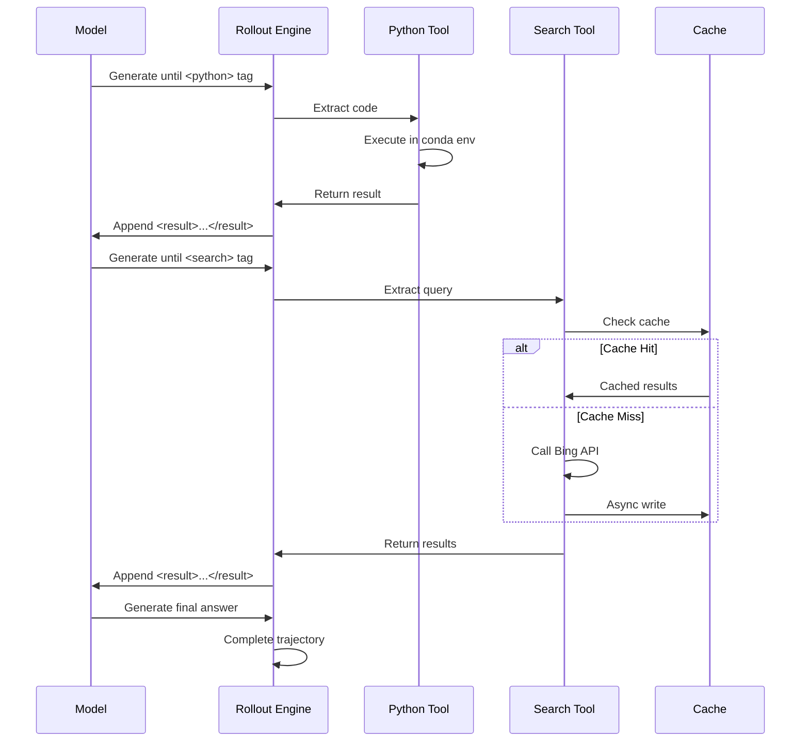
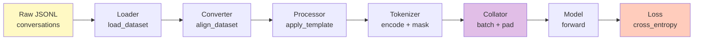
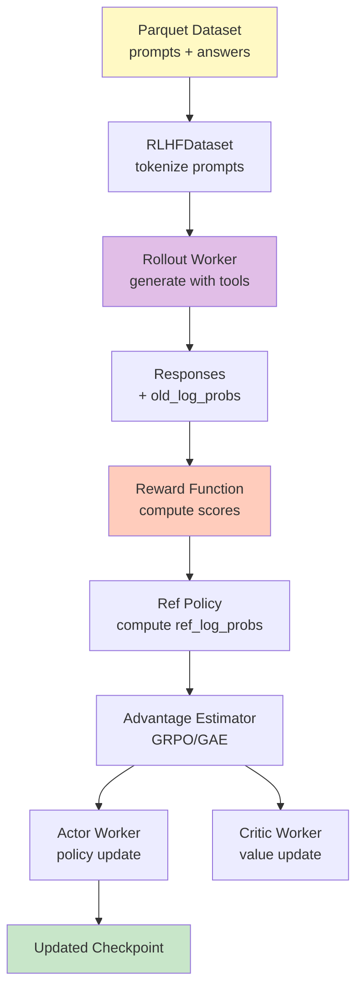
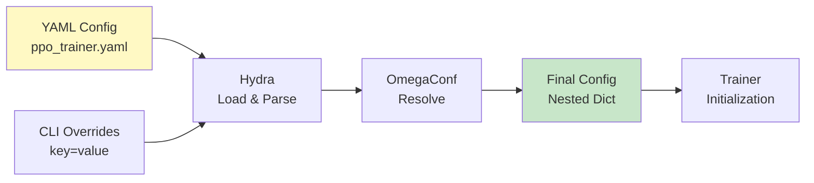

# ARPO Project Architecture Documentation

## Table of Contents

1. [Project Overview](#project-overview)
2. [Directory Structure](#directory-structure)
3. [System Architecture](#system-architecture)
4. [Core Components](#core-components)
5. [Data Flow](#data-flow)
6. [Key Classes and Functions](#key-classes-and-functions)
7. [Configuration Management](#configuration-management)

***

## Project Overview

ARPO (Agentic Reinforced Policy Optimization) is a reinforcement learning framework for training multi-turn LLM-based agents with tool integration. The project includes two main RL algorithms:

* **ARPO**: Encourages adaptive branch sampling during high-entropy tool-call rounds

* **AEPO**: Balances entropy in both rollout and policy update phases

The codebase is organized into three main stages:

1. **SFT (Supervised Fine-Tuning)**: Cold-start training using LLaMA-Factory
2. **RL Training**: ARPO/AEPO training using VERL framework
3. **Evaluation**: Multi-benchmark testing with tool-augmented inference

***

## Directory Structure

### High-Level Organization



### Detailed Directory Breakdown

#### 1. LLaMA-Factory (SFT Stage)

**Purpose**: Supervised Fine-Tuning with multi-tool conversation data

```
LLaMA-Factory/
├── src/llamafactory/           # Core training framework
│   ├── train/                  # Training workflows
│   │   ├── tuner.py           # Main orchestrator
│   │   ├── sft/               # SFT-specific logic
│   │   │   ├── workflow.py    # SFT execution flow
│   │   │   └── trainer.py     # CustomSeq2SeqTrainer
│   │   ├── ppo/               # PPO training (unused in ARPO)
│   │   └── dpo/               # DPO training (unused in ARPO)
│   ├── data/                   # Data processing
│   │   ├── loader.py          # Dataset loading
│   │   ├── processor/         # Data processors
│   │   │   └── supervised.py  # SFT data processor
│   │   ├── converter.py       # Format converters
│   │   └── collator.py        # Batch collation
│   ├── model/                  # Model management
│   │   ├── loader.py          # Model loading
│   │   └── adapter.py         # LoRA adapters
│   └── hparams/                # Hyperparameters
│       └── parser.py          # Config parsing
├── arpo_train_sft/             # ARPO SFT configurations
│   ├── yaml/                   # Training configs
│   │   └── sft_config.yaml    # SFT hyperparameters
│   ├── dataset_info/          # Dataset metadata
│   │   └── dataset_info.json  # Dataset definitions
│   └── sft_train.sh           # Training launch script
└── data/                       # SFT datasets
    └── final_sft_edition9.json # 54K training samples
```

**Key Role**: Provides initial policy checkpoint for RL training

#### 2. ARPO/AEPO (RL Training Stage)

**Purpose**: Reinforcement learning with tool-augmented rollouts

```
ARPO/ (or AEPO/)
├── verl_arpo_entropy/          # VERL framework
│   └── verl/
│       ├── trainer/            # Training orchestration
│       │   ├── main_ppo.py    # RL training entry point
│       │   └── ppo/
│       │       ├── ray_trainer.py      # Distributed RL trainer
│       │       ├── core_algos.py       # PPO/GRPO algorithms
│       │       └── reward.py           # Reward management
│       ├── workers/            # Distributed workers
│       │   ├── fsdp_workers.py         # FSDP-based workers
│       │   ├── rollout/        # Generation workers
│       │   │   ├── vllm_rollout/
│       │   │   │   ├── vllm_rollout_with_tools.py  # Tool-integrated rollout
│       │   │   │   └── vllm_rollout.py             # Standard rollout
│       │   │   └── tools/      # Tool implementations
│       │   │       ├── base_tool.py    # Tool interface
│       │   │       ├── python_tool.py  # Python executor
│       │   │       └── search_tool.py  # Bing search
│       │   └── actor/          # Policy gradient workers
│       ├── models/             # Model architectures
│       │   ├── transformers/   # HF integration
│       │   ├── qwen2/          # Qwen2 models
│       │   └── llama/          # LLaMA models
│       └── utils/              # Utilities
│           ├── dataset/        # RL datasets
│           │   └── rl_dataset.py       # Parquet loader
│           └── reward_score/   # Reward functions
│               ├── deep_research.py    # Search task rewards
│               └── math.py             # Math task rewards
├── scripts/                    # Training scripts
│   ├── config/
│   │   └── ppo_trainer.yaml   # RL hyperparameters
│   ├── ARPO_7B_Reasoning_1node.sh     # 7B training script
│   └── ARPO_14B_DeepSearch.sh         # 14B training script
├── rl_datasets/                # RL training data
│   ├── train.parquet          # 10K reasoning samples
│   ├── valid.parquet          # Validation set
│   └── hard_search.parquet    # 1K deep search samples
└── search_cache/               # Cached search results
    └── search_cache.json      # Shared search cache
```

**Key Role**: Trains policy to use tools effectively via RL

**AEPO Differences**:

* `enable_dynamic_rollouts`: Dynamic entropy-balanced rollout

* `enable_entropy_balanced_clipping`: Stop-gradient on high entropy

* `enable_entropy_balanced_advantage`: Entropy-aware advantage

#### 3. Evaluation (Testing Framework)

**Purpose**: Multi-benchmark evaluation with tool support

```
evaluation/
├── src/                        # Evaluation engine
│   ├── inference_engine.py    # Multi-turn generation
│   ├── tool_executor.py       # Tool execution
│   ├── sample_processor.py    # Answer extraction
│   └── llm_evaluator_sds.py   # LLM-based grading
├── data/                       # Test datasets (13 benchmarks)
│   ├── aime24/                # Math (AIME 2024)
│   ├── gaia/                  # GAIA benchmark
│   ├── hle/                   # Humanity Last Exam
│   ├── gsm8k/                 # Grade school math
│   └── ...
├── vllm_scripts/              # Inference servers
│   ├── vllm_launch_reasoning_model.sh    # Model server
│   └── vllm_launch_summarize_model.sh    # Judge server
├── infer_local_sds.sh         # Evaluation script
└── evaluate_passk.sh          # Metric computation
```

**Key Role**: Validates trained models on diverse benchmarks

***

## System Architecture

### Overall Training Pipeline

```mermaid
graph LR
    A[Raw Data<br/>54K SFT Samples] --> B[SFT Training<br/>LLaMA-Factory]
    B --> C[SFT Checkpoint<br/>Qwen/LLaMA]
    C --> D[RL Training<br/>ARPO/AEPO]
    E[RL Data<br/>10K Samples] --> D
    D --> F[RL Checkpoint<br/>Final Model]
    F --> G[Evaluation<br/>13 Benchmarks]
    G --> H[Metrics<br/>Pass@1, Pass@5]

    style A fill:#fff9c4
    style C fill:#c8e6c9
    style E fill:#fff9c4
    style F fill:#c8e6c9
    style H fill:#b3e5fc
```

### SFT Training Architecture



### RL Training Architecture



### Tool Execution Flow



***

## Core Components

### 1. SFT Training Components

#### Main Orchestrator

**File**: `LLaMA-Factory/src/llamafactory/train/tuner.py`

**Function**: `run_exp()`

* Entry point for all training workflows

* Initializes distributed training

* Routes to specific stage (SFT/PPO/DPO)

**Key Code**:

```python
def run_exp():
    # Parse arguments
    model_args, data_args, training_args, finetuning_args, generating_args = get_train_args()

    # Setup callbacks
    callbacks = [LogCallback(), ReporterCallback()]

    # Route to training function
    if finetuning_args.stage == "sft":
        run_sft(model_args, data_args, training_args, finetuning_args, callbacks)
    # ... other stages
```

#### Dataset Loader

**File**: `LLaMA-Factory/src/llamafactory/data/loader.py`

**Function**: `get_dataset()`

* Loads datasets from JSONL/JSON

* Applies chat template

* Tokenizes with masking

**Key Code**:

```python
def get_dataset(model_args, data_args):
    # Load dataset info
    dataset_info = load_dataset_info(data_args.dataset_dir)

    # Load and align dataset
    dataset = load_dataset("json", data_files=files)
    dataset = align_dataset(dataset, dataset_info)

    # Preprocess (tokenize)
    dataset = preprocess_dataset(dataset, tokenizer, template)

    return dataset
```

#### Custom Trainer

**File**: `LLaMA-Factory/src/llamafactory/train/sft/trainer.py`

**Class**: `CustomSeq2SeqTrainer`

* Extends HuggingFace Seq2SeqTrainer

* Supports DeepSpeed ZeRO-3

* Custom optimizer/scheduler creation

**Key Methods**:

```python
class CustomSeq2SeqTrainer(Seq2SeqTrainer):
    def create_optimizer(self):
        # Create AdamW or custom optimizer
        pass

    def create_scheduler(self):
        # Create LR scheduler (cosine/linear)
        pass

    def compute_loss(self, model, inputs):
        # Compute cross-entropy loss
        return model(**inputs).loss
```

### 2. RL Training Components

#### Main Trainer

**File**: `ARPO/verl_arpo_entropy/verl/trainer/ppo/ray_trainer.py`

**Class**: `RayPPOTrainer`

* Orchestrates distributed RL training

* Manages worker groups via Ray

* Implements PPO/GRPO training loop

**Key Methods**:

```python
class RayPPOTrainer:
    def init_workers(self):
        # Create Actor, Rollout, Critic, RefPolicy workers
        self.actor_rollout_wg = create_actor_rollout_worker_group()
        self.critic_wg = create_critic_worker_group()

    def fit(self):
        for epoch in range(total_epochs):
            for batch in dataloader:
                # 1. Rollout
                rollout_data = self.actor_rollout_wg.generate_sequences(batch)

                # 2. Compute reward
                rewards = self.reward_fn(rollout_data)

                # 3. Compute advantages
                advantages = compute_grpo_advantage(rewards)

                # 4. Update policy
                self.actor_rollout_wg.update_policy(rollout_data, advantages)

                # 5. Update critic
                self.critic_wg.update_critic(rollout_data, advantages)
```

#### Tool-Augmented Rollout

**File**: `ARPO/verl_arpo_entropy/verl/workers/rollout/vllm_rollout/vllm_rollout_with_tools.py`

**Class**: `vLLMRolloutWithTools`

* Multi-turn generation with tool calls

* ARPO branching based on entropy

* Concurrent tool execution

**Key Methods**:

```python
class vLLMRolloutWithTools(vLLMRollout):
    def generate_sequences(self, prompts):
        active_requests = self._init_requests(prompts)

        while active_requests:
            # Generate until tool tag or EOS
            outputs = self.vllm_engine.generate(
                prompts=[r["prompt"] for r in active_requests],
                stop=self.stop_sequences
            )

            # Process tool calls
            for req, output in zip(active_requests, outputs):
                if self._has_tool_call(output):
                    # Execute tool
                    result = self._execute_tool(output)
                    req["prompt"] += output + f"<result>{result}</result>"

                    # ARPO branching
                    if self._should_branch(req):
                        self._create_branches(req)
                else:
                    # Finalize
                    req["completed"] = True

        return self._format_output(completed_requests)

    def _should_branch(self, request):
        # Entropy-based branching logic
        entropy = self._compute_entropy(request)
        threshold = self.entropy_weight * self.base_entropy
        return entropy > threshold and random() < self.branch_probability
```

#### Core Algorithms

**File**: `ARPO/verl_arpo_entropy/verl/trainer/ppo/core_algos.py`

**Key Functions**:

1. **GAE Advantage Estimation**:

```python
def compute_gae_advantage_return(values, rewards, gamma=0.99, lam=0.95):
    """Generalized Advantage Estimation"""
    advantages = torch.zeros_like(rewards)
    last_advantage = 0

    for t in reversed(range(len(rewards))):
        delta = rewards[t] + gamma * values[t+1] - values[t]
        advantages[t] = delta + gamma * lam * last_advantage
        last_advantage = advantages[t]

    returns = advantages + values
    return advantages, returns
```

1. **GRPO Advantage**:

```python
def compute_grpo_outcome_advantage(rewards, responses):
    """Group Relative Policy Optimization"""
    # Group by prompt
    grouped_rewards = group_by_prompt(rewards, responses)

    # Normalize within group
    for group in grouped_rewards:
        mean = group.mean()
        std = group.std()
        group[:] = (group - mean) / (std + 1e-8)

    return grouped_rewards
```

1. **PPO Loss**:

```python
def compute_ppo_loss(log_probs, old_log_probs, advantages, clip_ratio=0.2):
    """PPO clipped objective"""
    ratio = torch.exp(log_probs - old_log_probs)
    clipped_ratio = torch.clamp(ratio, 1 - clip_ratio, 1 + clip_ratio)

    loss = -torch.min(
        ratio * advantages,
        clipped_ratio * advantages
    )

    return loss.mean()
```

#### Tool Implementations

**Python Tool** - `ARPO/verl_arpo_entropy/verl/workers/rollout/tools/python_tool.py`:

```python
class PythonTool(BaseTool):
    @property
    def name(self) -> str:
        return "Python"

    @property
    def trigger_tag(self) -> str:
        return "python"

    def execute(self, code: str, **kwargs) -> str:
        # Preprocess code (convert expressions to prints)
        code = self._preprocess_code(code)

        # Execute in conda environment
        cmd = f"{self.conda_path}/envs/{self.conda_env}/bin/python -c '{code}'"

        try:
            result = subprocess.run(
                cmd,
                capture_output=True,
                timeout=self.timeout,
                text=True
            )
            return result.stdout
        except subprocess.TimeoutExpired:
            return "Error: Execution timeout"
```

**Search Tool** - `ARPO/verl_arpo_entropy/verl/workers/rollout/tools/search_tool.py`:

```python
class BingSearchTool(BaseTool):
    @property
    def name(self) -> str:
        return "Search"

    @property
    def trigger_tag(self) -> str:
        return "search"

    def execute(self, query: str, **kwargs) -> str:
        # Check cache
        if query in self._cache:
            return self._cache[query]

        # Call Bing API
        results = self._api_call(query)

        # Format results
        formatted = self._format_results(results)

        # Async cache write
        self._write_queue.put((query, formatted))

        return formatted

    def _api_call(self, query):
        # Brightdata Bing API
        url = f"https://api.brightdata.com/serp/bing"
        params = {
            "q": query,
            "api_key": self.api_key,
            "zone": self.zone,
            "num": self.max_results
        }
        response = requests.get(url, params=params)
        return response.json()
```

### 3. Reward Functions

**Deep Research Reward** - `ARPO/verl_arpo_entropy/verl/utils/reward_score/deep_research.py`:

```python
def compute_score(data: List[Dict]) -> List[float]:
    """
    Reward function for deep research tasks (GAIA, HLE)

    Args:
        data: List of {output, answer, data_source}

    Returns:
        scores: List of floats [0.0, 1.0]
    """
    scores = []
    for sample in data:
        response = sample["output"]
        ground_truth = sample["answer"]

        # 1. Format validation (20% weight)
        is_valid, reason = validate_format(response)
        format_score = 0.2 if is_valid else 0.0

        # 2. Answer extraction
        extracted_answer = extract_boxed_answer(response)

        # 3. Correctness check (80% weight)
        is_correct = compare_answers(extracted_answer, ground_truth)
        correctness_score = 0.8 if is_correct else 0.0

        # 4. Total score
        total = format_score + correctness_score
        scores.append(total)

    return scores
```

**Math Reward** - `ARPO/verl_arpo_entropy/verl/utils/reward_score/math.py`:

```python
def compute_score(data: List[Dict]) -> List[float]:
    """
    Reward function for math tasks (AIME, MATH500, GSM8K)
    """
    scores = []
    for sample in data:
        # Extract answer
        pred = extract_boxed_answer(sample["output"])
        truth = sample["answer"]

        # Normalize and compare
        pred_normalized = normalize_math_answer(pred)
        truth_normalized = normalize_math_answer(truth)

        # Exact match
        is_correct = (pred_normalized == truth_normalized)
        scores.append(1.0 if is_correct else 0.0)

    return scores
```

***

## Data Flow

### SFT Data Flow



**Data Format Evolution**:

1. **Raw JSONL**:

```json
{
  "conversations": [
    {"from": "user", "value": "What is 2+2?"},
    {"from": "assistant", "value": "<think>Let me calculate</think><python>print(2+2)</python>"},
    {"from": "user", "value": "<result>4</result>"},
    {"from": "assistant", "value": "The answer is 4"}
  ]
}
```

1. **After Alignment**:

```python
{
  "_prompt": [
    {"role": "user", "content": "What is 2+2?"},
    {"role": "assistant", "content": "<think>...</think><python>..."},
    {"role": "user", "content": "<result>4</result>"}
  ],
  "_response": [
    {"role": "assistant", "content": "The answer is 4"}
  ],
  "_system": ""
}
```

1. **After Tokenization**:

```python
{
  "input_ids": [151644, 872, 198, ...],  # Token IDs
  "attention_mask": [1, 1, 1, ...],
  "labels": [-100, -100, ..., 198, 872]  # -100 masks prompt
}
```

1. **After Collation (Batch)**:

```python
{
  "input_ids": torch.Tensor([[...], [...]]),      # [batch, max_len]
  "attention_mask": torch.Tensor([[...], [...]]),
  "labels": torch.Tensor([[...], [...]])
}
```

### RL Data Flow



**RL Data Format**:

1. **Input Parquet**:

```python
{
  "prompt": "What is the capital of France?",
  "answer": "Paris",
  "data_source": "bamboogle",
  "tools": ["search"]
}
```

1. **Rollout Output (DataProto)**:

```python
{
  "prompts": ["What is..."],
  "responses": torch.Tensor([[...], [...]]),      # [batch*n, seq_len]
  "old_log_probs": torch.Tensor([[...], [...]]),
  "attention_mask": torch.Tensor([[...], [...]]),
  "ref_log_prob": torch.Tensor([[...], [...]]),
  "token_level_rewards": torch.Tensor([[...], [...]]),
  "data_source": ["bamboogle", ...]
}
```

1. **After Advantage Estimation**:

```python
{
  ...all above,
  "advantages": torch.Tensor([[...], [...]]),  # [batch*n, seq_len]
  "returns": torch.Tensor([[...], [...]])
}
```

***

## Key Classes and Functions

### SFT Stage

| Component           | File Path                                                     | Key Functions/Methods              |
| ------------------- | ------------------------------------------------------------- | ---------------------------------- |
| **Main Entry**      | `LLaMA-Factory/src/llamafactory/train/tuner.py`               | `run_exp()`                        |
| **SFT Workflow**    | `LLaMA-Factory/src/llamafactory/train/sft/workflow.py`        | `run_sft()`                        |
| **Trainer**         | `LLaMA-Factory/src/llamafactory/train/sft/trainer.py`         | `CustomSeq2SeqTrainer`             |
| **Data Loader**     | `LLaMA-Factory/src/llamafactory/data/loader.py`               | `get_dataset()`                    |
| **Data Processor**  | `LLaMA-Factory/src/llamafactory/data/processor/supervised.py` | `SupervisedDatasetProcessor`       |
| **Model Loader**    | `LLaMA-Factory/src/llamafactory/model/loader.py`              | `load_model()`, `load_tokenizer()` |
| **Argument Parser** | `LLaMA-Factory/src/llamafactory/hparams/parser.py`            | `get_train_args()`                 |

### RL Stage

| Component       | File Path                                                                             | Key Functions/Methods                                                              |
| --------------- | ------------------------------------------------------------------------------------- | ---------------------------------------------------------------------------------- |
| **Main Entry**  | `ARPO/verl_arpo_entropy/verl/trainer/main_ppo.py`                                     | `main()`                                                                           |
| **PPO Trainer** | `ARPO/verl_arpo_entropy/verl/trainer/ppo/ray_trainer.py`                              | `RayPPOTrainer.fit()`                                                              |
| **Algorithms**  | `ARPO/verl_arpo_entropy/verl/trainer/ppo/core_algos.py`                               | `compute_gae_advantage_return()`, `compute_grpo_advantage()`, `compute_ppo_loss()` |
| **Workers**     | `ARPO/verl_arpo_entropy/verl/workers/fsdp_workers.py`                                 | `ActorRolloutRefWorker`                                                            |
| **Rollout**     | `ARPO/verl_arpo_entropy/verl/workers/rollout/vllm_rollout/vllm_rollout_with_tools.py` | `vLLMRolloutWithTools.generate_sequences()`                                        |
| **Python Tool** | `ARPO/verl_arpo_entropy/verl/workers/rollout/tools/python_tool.py`                    | `PythonTool.execute()`                                                             |
| **Search Tool** | `ARPO/verl_arpo_entropy/verl/workers/rollout/tools/search_tool.py`                    | `BingSearchTool.execute()`                                                         |
| **Dataset**     | `ARPO/verl_arpo_entropy/verl/utils/dataset/rl_dataset.py`                             | `RLHFDataset`                                                                      |
| **Rewards**     | `ARPO/verl_arpo_entropy/verl/utils/reward_score/`                                     | `compute_score()` functions                                                        |

***

## Configuration Management

### Hydra Configuration System (RL Training)



### Configuration Hierarchy

**Base Config**: `ARPO/scripts/config/ppo_trainer.yaml`

```yaml
# Data configuration
data:
  train_files: /path/to/train.parquet
  val_files: /path/to/valid.parquet
  train_batch_size: 128
  max_prompt_length: 1536
  max_response_length: 4096

# Model configuration
actor_rollout_ref:
  model:
    path: /path/to/sft_checkpoint
    enable_gradient_checkpointing: true

  # Actor (policy training)
  actor:
    ppo_mini_batch_size: 16
    optim:
      lr: 1e-6

  # Rollout (generation)
  rollout:
    name: vllm
    mode: sync_with_tool
    n: 16                    # Total samples
    initial_rollouts: 8      # Base samples
    beam_size: 2             # Branch factor
    branch_probability: 0.5
    entropy_weight: 0.2

    tools:
      tool_instances:
        python:
          class_path: verl.workers.rollout.tools.python_tool.PythonTool
          params:
            conda_path: /path/to/conda
            conda_env: verl

        search:
          class_path: verl.workers.rollout.tools.search_tool.BingSearchTool
          params:
            api_key: <api_key>
            zone: <zone>
            cache_file: /path/to/cache.json

# Reward configuration
reward_model:
  reward_manager: naive

custom_reward_function:
  path: /path/to/deep_research.py
  name: compute_score

# Training configuration
trainer:
  total_epochs: 2
  save_freq: 5
  test_freq: 5
  n_gpus_per_node: 8
  nnodes: 1
```

**CLI Overrides**:

```bash
python -m verl.trainer.main_ppo \
    --config-path=$CONFIG_PATH \
    --config-name=ppo_trainer.yaml \
    data.train_batch_size=64 \
    actor_rollout_ref.rollout.n=32
```

### YAML Config (SFT Training)

**Config**: `LLaMA-Factory/arpo_train_sft/yaml/sft_config.yaml`

```yaml
# Model
model_name_or_path: Qwen/Qwen2.5-7B-Instruct
trust_remote_code: true

# Training stage
stage: sft
do_train: true
finetuning_type: full

# DeepSpeed
deepspeed: ../examples/deepspeed/ds_z3_config.json

# Dataset
dataset_dir: dataset_info
dataset: arpo_sft_54k
template: qwen
cutoff_len: 15000

# Training hyperparameters
per_device_train_batch_size: 1
gradient_accumulation_steps: 2
learning_rate: 7.0e-6
num_train_epochs: 3.0
lr_scheduler_type: cosine
warmup_ratio: 0.1
bf16: true

# Output
output_dir: /path/to/output
save_steps: 2000
logging_steps: 10
```

***

## Summary

The ARPO project is a comprehensive framework for training agentic LLMs with:

1. **Modular Architecture**: Clear separation between SFT, RL, and evaluation stages
2. **Distributed Training**: Ray-based orchestration with FSDP sharding
3. **Tool Integration**: Plugin-based system for Python and Search tools
4. **Flexible Algorithms**: Support for PPO, GRPO, GAE, and custom methods
5. **Extensive Evaluation**: 13 benchmarks across math, knowledge, and search domains

**Key Innovation**: Entropy-based branching (ARPO) and entropy-balanced optimization (AEPO) for efficient tool-augmented RL training.
