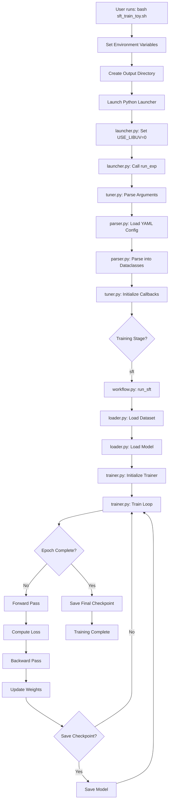
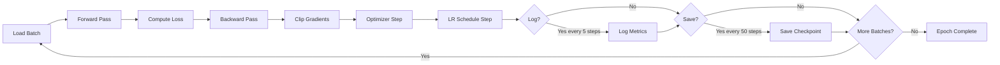
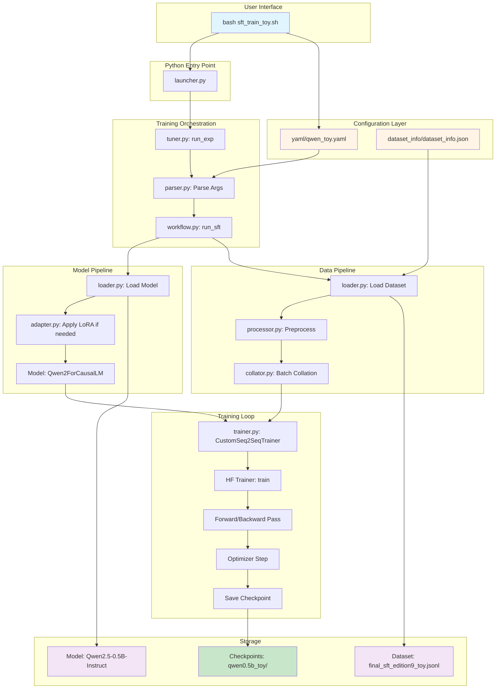
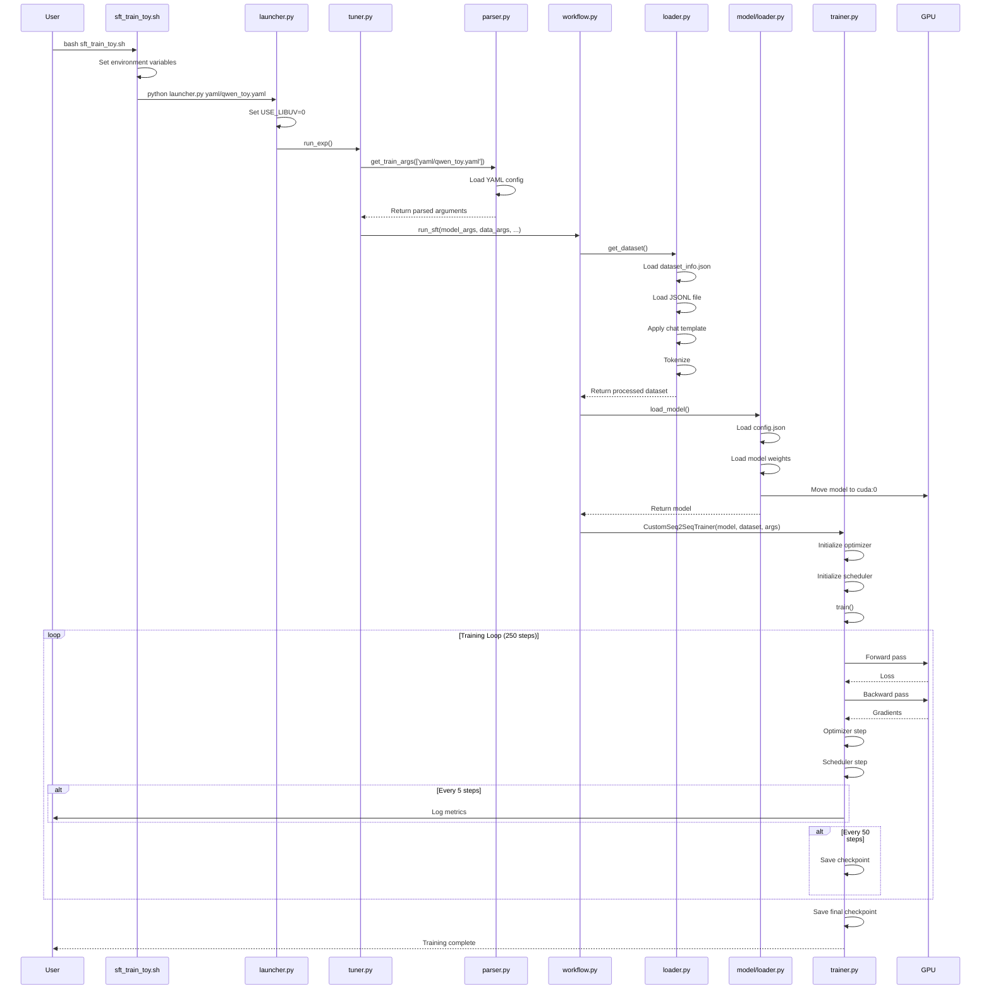

# LLaMA-Factory SFT Training Process - Complete Guide

**Date**: 2025-11-10
**Context**: ARPO Toy Training Setup (Qwen2.5-0.5B-Instruct, 500 samples)
**Environment**: Windows 11, Git Bash, conda environment `sft`

---

## Table of Contents

1. [Training Overview](#training-overview)
2. [Our Training Settings](#our-training-settings)
3. [Bash Script Configuration](#bash-script-configuration)
4. [Training Execution Flow](#training-execution-flow)
5. [Component Interactions](#component-interactions)
6. [File Structure & Paths](#file-structure--paths)

---

## Training Overview

### What is SFT (Supervised Fine-Tuning)?

SFT is the process of fine-tuning a pre-trained language model on task-specific data to adapt it for specialized use cases. In ARPO's context:

- **Input**: Pre-trained model (Qwen2.5-0.5B-Instruct) + Multi-turn conversation dataset
- **Process**: Update model weights using supervised learning on conversation pairs
- **Output**: Fine-tuned model checkpoint optimized for tool-augmented conversations

### LLaMA-Factory Framework

LLaMA-Factory is a unified framework for fine-tuning large language models, supporting:
- Multiple training methods: SFT, PPO, DPO, ORPO, etc.
- Various model architectures: LLaMA, Qwen, Mistral, etc.
- Optimization techniques: DeepSpeed, FSDP, LoRA, QLoRA
- Flexible data formats: ShareGPT, Alpaca, etc.

---

## Our Training Settings

### Hardware Configuration

```yaml
Platform: Windows 11 (MINGW64_NT-10.0-22631)
GPU: NVIDIA GeForce RTX 5070 Ti
VRAM: 16 GB
CUDA Version: 12.9 (driver) / 12.8 (PyTorch runtime)
CPUs: Multi-core (exact count varies)
RAM: Sufficient for toy training
```

### Model Configuration

```yaml
Model Name: Qwen2.5-0.5B-Instruct
Model Size: 988 MB (0.5 billion parameters)
Architecture: Qwen2ForCausalLM
Location: ../models/Qwen2.5-0.5B-Instruct/
Dtype: bfloat16 (BF16)
Trust Remote Code: true (required for Qwen models)
```

**Model Architecture Details**:
```json
{
  "hidden_size": 896,
  "intermediate_size": 4864,
  "num_attention_heads": 14,
  "num_hidden_layers": 24,
  "num_key_value_heads": 2,
  "vocab_size": 151936,
  "max_position_embeddings": 32768,
  "sliding_window": 32768
}
```

### Dataset Configuration

```yaml
Dataset Name: arpo_sft_toy
Dataset Size: 500 samples
Dataset File: ../../data/final_sft_edition9_toy.jsonl
Dataset Format: ShareGPT (multi-turn conversations)
Dataset Location: LLaMA-Factory/data/
Total Size: 4.5 MB
```

**Dataset Structure** (ShareGPT format):
```json
{
  "conversations": [
    {"from": "human", "value": "User question"},
    {"from": "gpt", "value": "Assistant response with <python>code</python>"},
    {"from": "human", "value": "<result>execution result</result>"},
    {"from": "gpt", "value": "Final answer"}
  ],
  "system": "Optional system prompt"
}
```

### Training Hyperparameters

```yaml
Training Method: Full parameter fine-tuning (not LoRA)
Training Stage: sft
Batch Size (per device): 2
Gradient Accumulation Steps: 1
Effective Batch Size: 2 (single GPU)
Learning Rate: 7.0e-6
LR Scheduler: cosine
Warmup Ratio: 0.1
Number of Epochs: 1.0
Max Sequence Length: 4096 tokens
Precision: BF16 (bfloat16)
DeepSpeed: Disabled (not installed)
Distributed Training: False (single GPU)
```

**Expected Training Metrics**:
- Total samples: 500
- Steps per epoch: ~250 (500 / 2)
- Total training steps: ~250 (1 epoch)
- Estimated time: 15-30 minutes
- Checkpoint frequency: Every 50 steps
- Logging frequency: Every 5 steps

### Output Configuration

```yaml
Output Directory: ./checkpoints/qwen0.5b_toy/
Save Strategy: steps
Save Steps: 50
Logging Steps: 5
Overwrite Output Dir: true
Plot Loss: true
```

---

## Bash Script Configuration

### Script: `sft_train_toy.sh`

#### Full Script Breakdown

```bash
#!/bin/bash

#================== Basic Configuration ==================#
# Use only first GPU for toy testing
export CUDA_VISIBLE_DEVICES=0          # Only use GPU 0
export PYTHONPATH=$(pwd):$PYTHONPATH   # Add current dir to Python path
export USE_LIBUV=0                     # Fix PyTorch distributed on Windows
export WANDB_DISABLED=true             # Disable Weights & Biases logging

#================== Training Parameter Configuration ==================#
# Single GPU training configuration
NNODES=1                 # Number of nodes (machines)
NODE_RANK=0              # This node's rank (0 for single node)
PROC_PER_NODE=1          # Number of processes per node (1 GPU)
MASTER_ADDR="127.0.0.1"  # Master node address (localhost)
MASTER_PORT=29501        # Master node port (different from default 29500)

# Output directory for toy model
OUTPUT_DIR="./checkpoints/qwen0.5b_toy"
mkdir -p ${OUTPUT_DIR}   # Create output directory if needed

# Path to the training script
TRAIN_SCRIPT="../src/llamafactory/launcher.py"

# Path to the toy training configuration file
TRAIN_ARGS="yaml/qwen_toy.yaml"

#================== Launch Training ==================#
# Command to launch training
USE_LIBUV=0 PYTHONPATH=$(pwd):$PYTHONPATH \
  python ${TRAIN_SCRIPT} ${TRAIN_ARGS} 2>&1 | tee ${OUTPUT_DIR}/training.log
```

#### Environment Variables Explained

| Variable | Value | Purpose |
|----------|-------|---------|
| `CUDA_VISIBLE_DEVICES` | `0` | Only use GPU 0 (first GPU) for training |
| `PYTHONPATH` | `$(pwd):$PYTHONPATH` | Add current directory to Python import path |
| `USE_LIBUV` | `0` | Disable libuv in PyTorch (Windows compatibility fix) |
| `WANDB_DISABLED` | `true` | Disable Weights & Biases experiment tracking |
| `NNODES` | `1` | Single machine training |
| `NODE_RANK` | `0` | This is the primary (only) node |
| `PROC_PER_NODE` | `1` | Single process (single GPU) |
| `MASTER_ADDR` | `127.0.0.1` | Localhost (not using distributed) |
| `MASTER_PORT` | `29501` | Port for coordination (unused in single GPU) |

#### Training Command Anatomy

```bash
USE_LIBUV=0 PYTHONPATH=$(pwd):$PYTHONPATH \
  python ${TRAIN_SCRIPT} ${TRAIN_ARGS} 2>&1 | tee ${OUTPUT_DIR}/training.log
```

**Breakdown**:
1. `USE_LIBUV=0` - Set environment variable for this command
2. `PYTHONPATH=$(pwd):$PYTHONPATH` - Set Python path for this command
3. `python` - Launch Python interpreter
4. `${TRAIN_SCRIPT}` - Execute `../src/llamafactory/launcher.py`
5. `${TRAIN_ARGS}` - Pass config file `yaml/qwen_toy.yaml`
6. `2>&1` - Redirect stderr to stdout
7. `| tee ${OUTPUT_DIR}/training.log` - Display output AND save to log file

---

## Training Execution Flow

### High-Level Flow Diagram



### Detailed Execution Trace

#### Phase 1: Script Initialization

```
┌─ bash sft_train_toy.sh
│
├─ Set Environment Variables
│  ├─ CUDA_VISIBLE_DEVICES=0
│  ├─ PYTHONPATH=<current_dir>:$PYTHONPATH
│  ├─ USE_LIBUV=0
│  └─ WANDB_DISABLED=true
│
├─ Create Output Directory
│  └─ mkdir -p ./checkpoints/qwen0.5b_toy
│
└─ Launch Python Command
   └─ python ../src/llamafactory/launcher.py yaml/qwen_toy.yaml
```

#### Phase 2: Python Launcher Initialization

**File**: `LLaMA-Factory/src/llamafactory/launcher.py`

```python
# Step 1: Set USE_LIBUV before any torch imports
os.environ["USE_LIBUV"] = "0"

# Step 2: Import training function
from llamafactory.train.tuner import run_exp

# Step 3: Launch training
def launch():
    run_exp()

if __name__ == "__main__":
    launch()
```

**Execution**:
```
launcher.py:20  → Set os.environ["USE_LIBUV"] = "0"
launcher.py:26  → Import run_exp from tuner.py
launcher.py:30  → Call run_exp()
```

#### Phase 3: Argument Parsing

**File**: `LLaMA-Factory/src/llamafactory/train/tuner.py`

```python
def run_exp():
    # Step 1: Parse command-line arguments (YAML file path)
    args = sys.argv[1:]  # ['yaml/qwen_toy.yaml']

    # Step 2: Initialize callbacks
    callbacks = [LogCallback(), ReporterCallback()]

    # Step 3: Create training function config
    config = {"args": args, "callbacks": callbacks}

    # Step 4: Execute training
    _training_function(config)

def _training_function(config):
    # Step 5: Parse all arguments from YAML
    model_args, data_args, training_args, finetuning_args, generating_args = \
        get_train_args(config["args"])

    # Step 6: Route to SFT workflow
    run_sft(model_args, data_args, training_args, finetuning_args,
            generating_args, config["callbacks"])
```

**File**: `LLaMA-Factory/src/llamafactory/hparams/parser.py`

```python
def get_train_args(args):
    # Step 1: Create argument parser
    parser = HfArgumentParser((
        ModelArguments,
        DataArguments,
        TrainingArguments,
        FinetuningArguments,
        GeneratingArguments
    ))

    # Step 2: Load YAML file
    yaml_path = args[0]  # 'yaml/qwen_toy.yaml'
    with open(yaml_path, 'r') as f:
        yaml_dict = yaml.safe_load(f)

    # Step 3: Parse into dataclass instances
    return parser.parse_dict(yaml_dict)
```

**Parsed Configuration Objects**:

```python
# ModelArguments
ModelArguments(
    model_name_or_path='../models/Qwen2.5-0.5B-Instruct',
    trust_remote_code=True
)

# DataArguments
DataArguments(
    dataset_dir='dataset_info',
    dataset='arpo_sft_toy',
    template='qwen',
    cutoff_len=4096,
    max_samples=500,
    preprocessing_num_workers=4
)

# TrainingArguments
TrainingArguments(
    output_dir='checkpoints/qwen0.5b_toy',
    per_device_train_batch_size=2,
    gradient_accumulation_steps=1,
    learning_rate=7.0e-6,
    num_train_epochs=1.0,
    lr_scheduler_type='cosine',
    warmup_ratio=0.1,
    bf16=True,
    logging_steps=5,
    save_steps=50,
    overwrite_output_dir=True
)

# FinetuningArguments
FinetuningArguments(
    stage='sft',
    do_train=True,
    finetuning_type='full'
)
```

#### Phase 4: Dataset Loading

**File**: `LLaMA-Factory/src/llamafactory/data/loader.py`

```python
def get_dataset(template, model_args, data_args, training_args, stage, tokenizer, processor):
    # Step 1: Load dataset info registry
    dataset_info = load_dataset_info(data_args.dataset_dir)  # 'dataset_info'

    # Step 2: Get dataset attributes for 'arpo_sft_toy'
    dataset_attr = dataset_info['arpo_sft_toy']
    # {
    #   "file_name": "../../data/final_sft_edition9_toy.jsonl",
    #   "formatting": "sharegpt",
    #   "columns": {"messages": "conversations", "system": "system"}
    # }

    # Step 3: Construct file path
    local_path = os.path.join(data_args.dataset_dir, dataset_attr['file_name'])
    # 'dataset_info/../../data/final_sft_edition9_toy.jsonl'
    # Resolves to: '../data/final_sft_edition9_toy.jsonl'

    # Step 4: Load raw dataset
    dataset = load_dataset('json', data_files=local_path)
    # Loads 500 samples from JSONL file

    # Step 5: Apply chat template and tokenize
    dataset = preprocess_dataset(dataset, tokenizer, template, data_args)

    return dataset
```

**Data Processing Pipeline**:

```
Raw JSONL Sample:
{
  "conversations": [
    {"from": "human", "value": "What is 2+2?"},
    {"from": "gpt", "value": "The answer is 4."}
  ]
}
        ↓
Apply Chat Template:
"<|im_start|>system\n...<|im_end|>\n<|im_start|>user\nWhat is 2+2?<|im_end|>\n<|im_start|>assistant\nThe answer is 4.<|im_end|>"
        ↓
Tokenize:
{
  "input_ids": [151644, 872, 198, ...],
  "attention_mask": [1, 1, 1, ...],
  "labels": [-100, -100, ..., 872, 198]  # -100 masks prompt tokens
}
        ↓
Batched Dataset Ready for Training
```

#### Phase 5: Model Loading

**File**: `LLaMA-Factory/src/llamafactory/model/loader.py`

```python
def load_model(model_args, finetuning_args, training_args):
    # Step 1: Load configuration
    config = AutoConfig.from_pretrained(
        model_args.model_name_or_path,  # '../models/Qwen2.5-0.5B-Instruct'
        trust_remote_code=True
    )

    # Step 2: Patch configuration for training
    config.use_cache = False  # Disable KV cache for training

    # Step 3: Load model
    model = AutoModelForCausalLM.from_pretrained(
        model_args.model_name_or_path,
        config=config,
        torch_dtype=torch.bfloat16,
        trust_remote_code=True
    )

    # Step 4: Enable gradient checkpointing (if configured)
    if training_args.gradient_checkpointing:
        model.gradient_checkpointing_enable()

    return model
```

**Model Loading Sequence**:
```
1. Load config.json           → Qwen2Config
2. Load model.safetensors     → Load 988 MB of weights
3. Configure for training     → Disable cache, set dtype
4. Move to GPU                → model.to('cuda:0')
5. Set training mode          → model.train()
```

#### Phase 6: Trainer Initialization

**File**: `LLaMA-Factory/src/llamafactory/train/sft/trainer.py`

```python
class CustomSeq2SeqTrainer(Seq2SeqTrainer):
    def __init__(self, model, args, data_collator, train_dataset, **kwargs):
        super().__init__(
            model=model,
            args=args,
            data_collator=data_collator,
            train_dataset=train_dataset,
            **kwargs
        )

    def create_optimizer(self):
        # Create AdamW optimizer
        optimizer = AdamW(
            self.model.parameters(),
            lr=self.args.learning_rate,
            betas=(0.9, 0.999),
            eps=1e-8,
            weight_decay=0.0
        )
        return optimizer

    def create_scheduler(self, optimizer):
        # Create cosine learning rate scheduler
        scheduler = get_cosine_schedule_with_warmup(
            optimizer,
            num_warmup_steps=int(self.args.warmup_ratio * self.args.max_steps),
            num_training_steps=self.args.max_steps
        )
        return scheduler
```

**Trainer Setup**:
```
Trainer Components:
├─ Model: Qwen2ForCausalLM (BF16)
├─ Optimizer: AdamW (lr=7e-6)
├─ Scheduler: Cosine with warmup (10% warmup)
├─ Data Collator: DataCollatorForSeq2Seq
├─ Train Dataset: 500 samples
└─ Callbacks: LogCallback, ReporterCallback
```

#### Phase 7: Training Loop

**File**: HuggingFace Transformers `Trainer.train()`

```python
def train(self):
    # Total steps = (500 samples / 2 batch size) * 1 epoch = 250 steps

    for epoch in range(num_epochs):  # 1 epoch
        for step, batch in enumerate(train_dataloader):
            # Step 1: Forward pass
            outputs = model(**batch)
            loss = outputs.loss

            # Step 2: Backward pass
            loss.backward()

            # Step 3: Gradient clipping (if configured)
            if max_grad_norm is not None:
                torch.nn.utils.clip_grad_norm_(model.parameters(), max_grad_norm)

            # Step 4: Optimizer step
            optimizer.step()
            optimizer.zero_grad()

            # Step 5: Scheduler step
            scheduler.step()

            # Step 6: Logging (every 5 steps)
            if step % logging_steps == 0:
                log_metrics({"loss": loss.item(), "lr": scheduler.get_last_lr()[0]})

            # Step 7: Save checkpoint (every 50 steps)
            if step % save_steps == 0:
                save_checkpoint(f"checkpoint-{step}")

    # Step 8: Save final checkpoint
    save_checkpoint("final")
```

**Training Loop Flow**:



**Single Training Step Breakdown**:

```
Step N (e.g., step 100):
┌─────────────────────────────────────────────────────
│ 1. Load Batch (2 samples)
│    ├─ input_ids: [2, 4096] tensor
│    ├─ attention_mask: [2, 4096] tensor
│    └─ labels: [2, 4096] tensor
│
│ 2. Forward Pass
│    ├─ model(input_ids, attention_mask)
│    ├─ logits: [2, 4096, 151936] (batch, seq_len, vocab_size)
│    └─ loss = CrossEntropyLoss(logits, labels)
│
│ 3. Backward Pass
│    ├─ loss.backward()
│    └─ Compute gradients for all parameters
│
│ 4. Optimizer Step
│    ├─ Clip gradients (if enabled)
│    ├─ optimizer.step()  # Update weights
│    └─ optimizer.zero_grad()  # Clear gradients
│
│ 5. LR Scheduler Step
│    └─ Cosine schedule: lr decreases from 7e-6
│
│ 6. Logging (if step % 5 == 0)
│    └─ Print: {"loss": 2.456, "lr": 6.8e-6, "step": 100}
│
│ 7. Save Checkpoint (if step % 50 == 0)
│    └─ Save: ./checkpoints/qwen0.5b_toy/checkpoint-100/
│
└─────────────────────────────────────────────────────
```

#### Phase 8: Checkpoint Saving

**File**: `LLaMA-Factory/src/llamafactory/train/sft/trainer.py`

```python
def _save_checkpoint(self, output_dir):
    # Step 1: Save model weights
    self.model.save_pretrained(output_dir)
    # Saves: model.safetensors (or pytorch_model.bin)

    # Step 2: Save tokenizer
    self.tokenizer.save_pretrained(output_dir)
    # Saves: tokenizer.json, tokenizer_config.json, etc.

    # Step 3: Save training state
    torch.save(self.optimizer.state_dict(), f"{output_dir}/optimizer.pt")
    torch.save(self.lr_scheduler.state_dict(), f"{output_dir}/scheduler.pt")

    # Step 4: Save training arguments
    torch.save(self.args, f"{output_dir}/training_args.bin")

    # Step 5: Save trainer state (step, epoch, etc.)
    with open(f"{output_dir}/trainer_state.json", 'w') as f:
        json.dump(self.state.to_dict(), f)
```

**Checkpoint Structure**:
```
checkpoints/qwen0.5b_toy/
├── checkpoint-50/
│   ├── model.safetensors        # Model weights at step 50
│   ├── config.json              # Model configuration
│   ├── tokenizer.json           # Tokenizer
│   ├── tokenizer_config.json    # Tokenizer config
│   ├── optimizer.pt             # Optimizer state
│   ├── scheduler.pt             # LR scheduler state
│   ├── trainer_state.json       # Training state
│   └── training_args.bin        # Training arguments
├── checkpoint-100/
├── checkpoint-150/
├── checkpoint-200/
├── checkpoint-250/              # Final checkpoint
└── training.log                 # Training log
```

---

## Component Interactions

### System Architecture Diagram



### Data Flow Diagram



---

## File Structure & Paths

### Directory Tree

```
LLaMA-Factory/
├── src/
│   └── llamafactory/
│       ├── launcher.py                 # Entry point
│       ├── train/
│       │   ├── tuner.py               # Main training orchestrator
│       │   └── sft/
│       │       ├── workflow.py        # SFT workflow
│       │       └── trainer.py         # Custom trainer
│       ├── data/
│       │   ├── loader.py              # Dataset loading
│       │   ├── processor/
│       │   │   └── supervised.py      # SFT data processing
│       │   └── collator.py            # Batch collation
│       ├── model/
│       │   └── loader.py              # Model loading
│       └── hparams/
│           └── parser.py              # Argument parsing
├── arpo_train_sft/
│   ├── sft_train_toy.sh               # Training launch script
│   ├── yaml/
│   │   └── qwen_toy.yaml              # Training configuration
│   ├── dataset_info/
│   │   └── dataset_info.json          # Dataset registry
│   └── checkpoints/
│       └── qwen0.5b_toy/              # Output directory
│           ├── checkpoint-50/
│           ├── checkpoint-100/
│           └── training.log
├── data/
│   └── final_sft_edition9_toy.jsonl   # Training dataset
└── models/
    └── Qwen2.5-0.5B-Instruct/         # Pre-trained model
        ├── model.safetensors
        ├── config.json
        └── tokenizer files
```

### Path Resolution Examples

**Working Directory**: `LLaMA-Factory/arpo_train_sft/`

| Config Parameter | Relative Path | Resolves To |
|-----------------|---------------|-------------|
| `model_name_or_path: ../models/Qwen2.5-0.5B-Instruct` | From `arpo_train_sft/` | `LLaMA-Factory/models/Qwen2.5-0.5B-Instruct/` |
| `dataset_dir: dataset_info` | From `arpo_train_sft/` | `LLaMA-Factory/arpo_train_sft/dataset_info/` |
| `file_name: ../../data/final_sft_edition9_toy.jsonl` | From `dataset_info/` | `LLaMA-Factory/data/final_sft_edition9_toy.jsonl` |
| `output_dir: checkpoints/qwen0.5b_toy` | From `arpo_train_sft/` | `LLaMA-Factory/arpo_train_sft/checkpoints/qwen0.5b_toy/` |
| `TRAIN_SCRIPT: ../src/llamafactory/launcher.py` | From `arpo_train_sft/` | `LLaMA-Factory/src/llamafactory/launcher.py` |

---

## Key Takeaways

### Training Pipeline Summary

1. **Initialization**: Bash script sets up environment and launches Python
2. **Configuration**: YAML and JSON files parsed into Python dataclasses
3. **Data Loading**: JSONL dataset loaded, templated, and tokenized
4. **Model Loading**: Pre-trained Qwen model loaded to GPU in BF16
5. **Training**: 250 steps of supervised learning with AdamW optimizer
6. **Checkpointing**: Model saved every 50 steps + final checkpoint

### Critical Configuration Points

1. **Environment Variables**:
   - `USE_LIBUV=0` - Essential for Windows PyTorch distributed
   - `CUDA_VISIBLE_DEVICES=0` - Controls GPU selection

2. **Path Configuration**:
   - All paths are relative to working directory
   - Dataset paths combine `dataset_dir` + `file_name`
   - Model paths can be local or HuggingFace model IDs

3. **Training Parameters**:
   - Batch size determines memory usage
   - Learning rate and scheduler control convergence
   - Save/log frequency balances monitoring vs. disk space

### Common Issues & Solutions

| Issue | Root Cause | Solution |
|-------|-----------|----------|
| DeepSpeed not found | Config references DeepSpeed but not installed | Comment out `deepspeed` line in YAML |
| Dataset not found | Incorrect path resolution | Fix `file_name` in `dataset_info.json` |
| CUDA OOM | Batch size too large | Reduce `per_device_train_batch_size` |
| USE_LIBUV error | PyTorch Windows incompatibility | Set `USE_LIBUV=0` in launcher.py and script |

---

## Appendix: Full Configuration File

### qwen_toy.yaml (Current Configuration)

```yaml
### model
model_name_or_path: ../models/Qwen2.5-0.5B-Instruct
trust_remote_code: true

### method
stage: sft
do_train: true
finetuning_type: full
# deepspeed: ../examples/deepspeed/ds_z2_config.json  # Commented out - not installed

### dataset
dataset_dir: dataset_info
dataset: arpo_sft_toy
template: qwen
cutoff_len: 4096
max_samples: 500
overwrite_cache: true
preprocessing_num_workers: 4

### output
output_dir: checkpoints/qwen0.5b_toy
logging_steps: 5
save_steps: 50
plot_loss: true
overwrite_output_dir: true

### train
per_device_train_batch_size: 2
gradient_accumulation_steps: 1
learning_rate: 7.0e-6
num_train_epochs: 1.0
lr_scheduler_type: cosine
warmup_ratio: 0.1
bf16: true
ddp_timeout: 180000000
```

### dataset_info.json (arpo_sft_toy entry)

```json
{
  "arpo_sft_toy": {
    "file_name": "../../data/final_sft_edition9_toy.jsonl",
    "formatting": "sharegpt",
    "columns": {
        "messages": "conversations",
        "system": "system"
    }
  }
}
```

---

**Document Version**: 1.0
**Last Updated**: 2025-11-10
**Author**: ARPO Training Debug Session
**Related Documents**:
- `SFT_Toy_Training_Debug_Log.md` - Debugging issues encountered
- `PyTorch_LIBUV_Windows_Fix.md` - Windows-specific fixes
- `PyTorch_DLL_Error_Windows_Troubleshooting.md` - Installation issues
