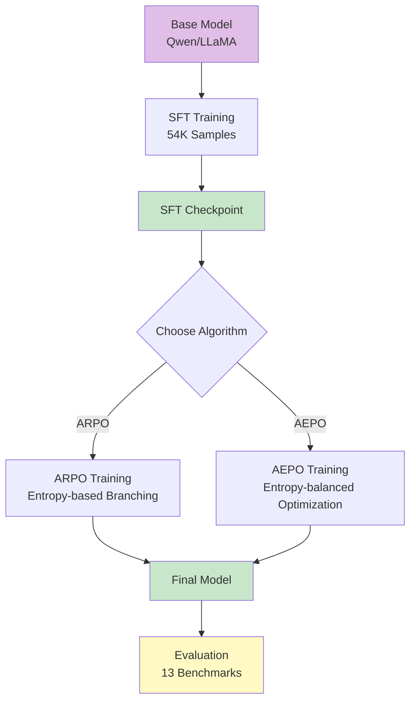

# ARPO/AEPO Project Documentation

Welcome to the comprehensive documentation for the ARPO (Agentic Reinforced Policy Optimization) and AEPO (Agentic Entropy-Balanced Policy Optimization) project.

## Documentation Overview

This documentation suite provides a complete understanding of the project structure, architecture, and step-by-step reproduction guides for training.

### Available Documents

1. **[ARPO_Project_Architecture.md](./ARPO_Project_Architecture.md)**
   - Complete project structure with directory explanations
   - System architecture with Mermaid diagrams
   - Core components and their relationships
   - Data flow visualization
   - Key classes and functions reference
   - Configuration management

2. **[SFT_Training_Guide.md](./SFT_Training_Guide.md)**
   - Step-by-step SFT (Supervised Fine-Tuning) reproduction guide
   - Environment setup instructions
   - Data preparation procedures
   - Configuration options explained
   - Training execution and monitoring
   - Troubleshooting common issues
   - Checkpoint management

3. **[RL_Training_Guide.md](./RL_Training_Guide.md)**
   - Complete RL training reproduction guide for ARPO and AEPO
   - Tool configuration (Python, Search)
   - ARPO training workflow
   - AEPO training workflow with entropy-balanced mechanisms
   - Monitoring and debugging
   - Checkpoint conversion to HuggingFace format

---

## Quick Start

### Understanding the Project


**Recommended Reading Order**:
1. Start with `ARPO_Project_Architecture.md` to understand the overall structure
2. Review `SFT_Training_Guide.md` to prepare for cold-start training
3. Follow `RL_Training_Guide.md` for reinforcement learning training

### Training Pipeline Overview



---

## Project Structure Summary

### Top-Level Organization

```
ARPO/
├── LLaMA-Factory/          # SFT training framework
├── ARPO/                   # ARPO RL training
├── AEPO/                   # AEPO RL training
├── evaluation/             # Evaluation framework
└── .trae/documents/        # This documentation
```

### Key Directories

| Directory | Purpose | Documentation |
|-----------|---------|---------------|
| `LLaMA-Factory/` | Supervised fine-tuning with multi-tool conversations | [SFT Guide](./SFT_Training_Guide.md) |
| `ARPO/` | RL training with adaptive branching | [RL Guide](./RL_Training_Guide.md#arpo-training) |
| `AEPO/` | RL training with entropy balancing | [RL Guide](./RL_Training_Guide.md#aepo-training) |
| `evaluation/` | Multi-benchmark testing | [Architecture](./ARPO_Project_Architecture.md#3-evaluation-testing-framework) |

---

## Training Stages Explained

### Stage 1: SFT (Supervised Fine-Tuning)

**Purpose**: Prepare base model for tool-augmented reasoning

**Input**:
- Base model (Qwen2.5/LLaMA3)
- 54K multi-turn tool conversations

**Output**:
- SFT checkpoint ready for RL

**Duration**: 6-12 hours (3 epochs, 8x A100)

**Guide**: [SFT_Training_Guide.md](./SFT_Training_Guide.md)

### Stage 2: RL Training (ARPO/AEPO)

**Purpose**: Optimize tool-use behavior via reinforcement learning

**Input**:
- SFT checkpoint
- 10K RL prompts (math, knowledge, search)

**Output**:
- RL checkpoint with enhanced tool capabilities

**Duration**: 4-12 hours (2-5 epochs, 8x A100)

**Guide**: [RL_Training_Guide.md](./RL_Training_Guide.md)

**Algorithm Options**:

| Algorithm | Key Features | Best For |
|-----------|--------------|----------|
| **ARPO** | Entropy-based branching, GRPO advantage | Efficient exploration, math/reasoning tasks |
| **AEPO** | Entropy-balanced clipping, entropy-aware advantage | Complex search, GAIA/HLE benchmarks |

### Stage 3: Evaluation

**Purpose**: Test model on 13 diverse benchmarks

**Benchmarks**:
- Math: AIME24, AIME25, MATH500, GSM8K
- Knowledge: HotpotQA, 2Wiki, Musique, Bamboogle
- Search: GAIA, HLE, SimpleQA
- Chinese: XBench

**Metrics**: Pass@1, Pass@5, tool call statistics

---

## Key Innovations

### ARPO: Adaptive Branching

```
High-Entropy Tool Call Detected
    ↓
Branch into beam_size paths
    ↓
Efficient exploration of tool-use behaviors
```

**When to Use**:
- Math reasoning tasks
- Limited compute budget
- Faster convergence needed

### AEPO: Entropy Balancing

```
Three Mechanisms:
1. Dynamic Rollout (optional)
2. Entropy Clipping-Balanced ✓
3. Entropy-aware Advantage ✓
```

**When to Use**:
- Complex search tasks (GAIA, HLE)
- High-quality final models
- Maximum performance

---

## Technical Highlights

### Distributed Training

- **Framework**: Ray + FSDP (Fully Sharded Data Parallel)
- **Memory Optimization**: DeepSpeed ZeRO-3, gradient checkpointing
- **Scalability**: Single node (8 GPUs) or multi-node

### Tool Integration

- **Python Tool**: Code execution in isolated conda environment
- **Search Tool**: Bing API with persistent caching
- **Extensible**: Plugin-based architecture for custom tools

### Advanced Features

- **Ulysses Sequence Parallel**: Handle long contexts (15K+ tokens)
- **Remove Padding**: Efficiency optimization
- **Flash Attention**: 2-3x training speedup
- **vLLM**: Fast generation with PagedAttention

---

## Datasets

### SFT Dataset (54K Samples)

**Source**: [dongguanting/ARPO-SFT-54K](https://huggingface.co/datasets/dongguanting/ARPO-SFT-54K)

**Format**: Multi-turn conversations with tool interactions

**Example**:
```json
{
  "conversations": [
    {"from": "user", "value": "What is 2+2?"},
    {"from": "assistant", "value": "<python>print(2+2)</python>"},
    {"from": "user", "value": "<result>4</result>"},
    {"from": "assistant", "value": "The answer is 4"}
  ]
}
```

### RL Datasets

**Reasoning (10K)**: [dongguanting/ARPO-RL-Reasoning-10K](https://huggingface.co/datasets/dongguanting/ARPO-RL-Reasoning-10K)

**Deep Search (1K)**: [dongguanting/ARPO-RL-DeepSearch-1K](https://huggingface.co/datasets/dongguanting/ARPO-RL-DeepSearch-1K)

---

## Model Zoo

### ARPO Models

| Model | Size | Use Case | Download |
|-------|------|----------|----------|
| Qwen2.5-3B-ARPO | 3B | Resource-constrained | [HF](https://huggingface.co/dongguanting/Qwen2.5-3B-ARPO) |
| Qwen2.5-7B-ARPO | 7B | General purpose | [HF](https://huggingface.co/dongguanting/Qwen2.5-7B-ARPO) |
| Qwen3-8B-ARPO-DeepSearch | 8B | Web search | [HF](https://huggingface.co/dongguanting/Qwen3-8B-ARPO-DeepSearch) |
| Qwen3-14B-ARPO-DeepSearch | 14B | Best performance | [HF](https://huggingface.co/dongguanting/Qwen3-14B-ARPO-DeepSearch) |

### AEPO Models

| Model | Size | Use Case | Download |
|-------|------|----------|----------|
| Qwen2.5-7B-AEPO | 7B | General purpose | [HF](https://huggingface.co/dongguanting/Qwen2.5-7B-AEPO) |
| Qwen3-8B-AEPO-DeepSearch | 8B | Web search | [HF](https://huggingface.co/dongguanting/Qwen3-8B-AEPO-DeepSearch) |
| Qwen3-14B-AEPO-DeepSearch | 14B | Best performance | [HF](https://huggingface.co/dongguanting/Qwen3-14B-AEPO-DeepSearch) |

---

## Configuration Quick Reference

### SFT Configuration

**File**: `LLaMA-Factory/arpo_train_sft/yaml/sft_config.yaml`

```yaml
model_name_or_path: Qwen/Qwen2.5-7B-Instruct
stage: sft
cutoff_len: 15000
learning_rate: 7.0e-6
num_train_epochs: 3
per_device_train_batch_size: 1
gradient_accumulation_steps: 2
```

### ARPO Configuration

**File**: `ARPO/scripts/config/ppo_trainer.yaml`

```yaml
data:
  train_batch_size: 128

actor_rollout_ref:
  actor:
    optim.lr: 1e-6
  rollout:
    n: 16
    initial_rollouts: 8
    beam_size: 2
    entropy_weight: 0.2
```

### AEPO Configuration

**Additional Flags**:
```yaml
actor_rollout_ref:
  actor:
    enable_entropy_balanced_clipping: true
    enable_entropy_balanced_advantage: true
  rollout:
    enable_dynamic_rollouts: false
```

---

## Common Commands

### SFT Training

```bash
# Setup
conda create -n sft python=3.10
conda activate sft
cd ARPO/LLaMA-Factory
pip install -r requirements.txt

# Train
cd arpo_train_sft
bash sft_train.sh
```

### ARPO Training

```bash
# Setup
conda create -n arpo python=3.10
conda activate arpo
cd ARPO/ARPO
pip install -r requirements.txt

# Train
bash scripts/ARPO_7B_Reasoning.sh
```

### AEPO Training

```bash
# Setup (same as ARPO)
cd ARPO/AEPO

# Train
bash scripts/AEPO_Qwen3_14B_DeepResearch.sh
```

---

## Troubleshooting Resources

### Common Issues

| Issue | Guide Section |
|-------|---------------|
| CUDA out of memory | [SFT Guide - Debugging](./SFT_Training_Guide.md#debugging-common-issues) |
| Tool execution timeout | [RL Guide - Common Issues](./RL_Training_Guide.md#monitoring-and-debugging) |
| Training diverges | [RL Guide - Issue 4](./RL_Training_Guide.md#issue-4-training-diverges-loss--nan) |
| Dataset loading error | [SFT Guide - Issue 4](./SFT_Training_Guide.md#issue-4-dataset-loading-error) |
| Ray cluster issues | [RL Guide - Ray Cluster](./RL_Training_Guide.md#ray-cluster-issues) |

---

## Performance Benchmarks

### ARPO Results (from paper)

| Model | GAIA (Pass@5) | HLE (Pass@5) | AIME24 (Pass@1) | MATH500 (Pass@1) |
|-------|---------------|--------------|-----------------|------------------|
| Qwen3-14B-ARPO | 61.2% | 24.0% | 26.7% | 84.2% |
| Qwen2.5-7B-ARPO | 48.3% | 18.5% | 20.0% | 78.6% |

### AEPO Results

| Model | GAIA (Pass@5) | HLE (Pass@5) |
|-------|---------------|--------------|
| Qwen3-14B-AEPO | 64.5% | 26.3% |
| Qwen2.5-7B-AEPO | 51.2% | 20.1% |

**Key Insight**: AEPO consistently outperforms ARPO on complex search tasks while maintaining competitive performance on reasoning tasks.

---

## Research Papers

### ARPO

- **Title**: Agentic Reinforced Policy Optimization
- **arXiv**: [2507.19849](https://arxiv.org/abs/2507.19849)
- **HuggingFace**: [Daily Paper #1](https://huggingface.co/papers/2507.19849)

### AEPO

- **Title**: Agentic Entropy-Balanced Policy Optimization
- **arXiv**: [2510.14545](https://arxiv.org/abs/2510.14545)
- **HuggingFace**: [Daily Paper](https://huggingface.co/papers/2510.14545)

---

## Citation

If you use this project in your research, please cite:

```bibtex
@article{dong2025arpo,
  title={Agentic Reinforced Policy Optimization},
  author={Dong, Guanting and Mao, Hangyu and Ma, Kai and others},
  journal={arXiv preprint arXiv:2507.19849},
  year={2025}
}

@article{dong2025aepo,
  title={Agentic Entropy-Balanced Policy Optimization},
  author={Dong, Guanting and Bao, Licheng and Wang, Zhongyuan and others},
  journal={arXiv preprint arXiv:2510.14545},
  year={2025}
}
```

---

## Additional Resources

### Official Links

- **GitHub**: https://github.com/dongguanting/ARPO
- **HuggingFace (ARPO)**: https://huggingface.co/collections/dongguanting/arpo-688229ff8a6143fe5b4ad8ae
- **HuggingFace (AEPO)**: https://huggingface.co/collections/dongguanting/aepo-68ef6832c99697ee03d5e1c7

### Related Projects

- **Tool-Star**: Multi-tool reasoner via RL ([arXiv:2505.16410](https://arxiv.org/abs/2505.16410))
- **DeepAgent**: General reasoning agent with scalable toolsets ([arXiv:2510.21618](https://arxiv.org/abs/2510.21618))

### Community

- **Twitter**: [@kakakbibibi](https://x.com/kakakbibibi/status/1950211490943832393)
- **YouTube**: [ARPO Introduction](https://www.youtube.com/watch?v=FOK2tRtq7TE)

---

## Contributing

Contributions are welcome! Please refer to the main repository for contribution guidelines.

---

## License

This project is released under the MIT License.

---

## Contact

For questions or feedback:
- **Email**: dongguanting@ruc.edu.cn
- **GitHub Issues**: https://github.com/dongguanting/ARPO/issues

---

## Acknowledgments

This documentation was created to provide comprehensive guidance for reproducing ARPO/AEPO training. Special thanks to:

- RUC-NLPIR team for the original implementation
- Kuaishou Technology for collaboration
- Open-source communities: VERL, LLaMA-Factory, vLLM, Ray

---

**Last Updated**: 2025-11-08

**Documentation Version**: 1.0

**Project Version**: ARPO 1.0 + AEPO 1.0
