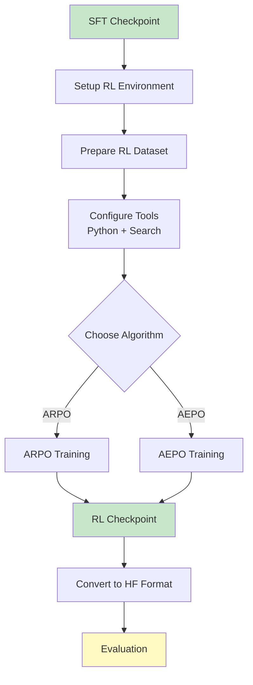

# ARPO/AEPO RL Training - Complete Reproduction Guide

## Table of Contents

1. [Overview](#overview)
2. [Prerequisites](#prerequisites)
3. [Environment Setup](#environment-setup)
4. [Data Preparation](#data-preparation)
5. [API Configuration](#api-configuration)
6. [Training Configuration](#training-configuration)
7. [ARPO Training](#arpo-training)
8. [AEPO Training](#aepo-training)
9. [Monitoring and Debugging](#monitoring-and-debugging)
10. [Checkpoint Conversion](#checkpoint-conversion)
11. [Troubleshooting](#troubleshooting)

---

## Overview

This guide provides complete instructions for reproducing the Reinforcement Learning (RL) training stage of ARPO and AEPO algorithms. RL training teaches the model to effectively use tools (Python interpreter, web search) through policy gradient optimization.

### Key Concepts

**ARPO (Agentic Reinforced Policy Optimization)**:
- Adaptive branch sampling at high-entropy tool-call rounds
- Efficient exploration of tool-use behaviors
- Group Relative Policy Optimization (GRPO) for advantage estimation

**AEPO (Agentic Entropy-Balanced Policy Optimization)**:
- Dynamic entropy-balanced rollout mechanism
- Entropy clipping-balanced gradient computation
- Entropy-aware advantage estimation

### Training Workflow



---

## Prerequisites

### Hardware Requirements

**Minimum**:
- 1 node with 8x NVIDIA A100 (40GB) or equivalent
- 512GB System RAM
- 1TB NVMe SSD for cache and checkpoints

**Recommended**:
- 1-2 nodes with 8x NVIDIA A100 (80GB)
- 1TB System RAM
- 2TB NVMe SSD

**Estimated Training Time**:
- 7B model: ~4-6 hours (2 epochs, 128 batch size)
- 14B model: ~8-12 hours (2 epochs, 64 batch size)

### Software Requirements

- **OS**: Linux (Ubuntu 20.04/22.04)
- **CUDA**: 12.1+ (for vLLM compatibility)
- **Python**: 3.10
- **Ray**: For distributed training

### Required Accounts

- **Bright Data Account**: For Bing Search API (or alternative search API)
- **WandB Account** (Optional): For experiment tracking

---

## Environment Setup

### Step 1: Clone Repository and Navigate

```bash
# Clone ARPO repository (if not already done)
git clone https://github.com/dongguanting/ARPO
cd ARPO/ARPO  # or ARPO/AEPO for AEPO
```

### Step 2: Create Conda Environment

```bash
# Create new environment
conda create -n arpo python==3.10
conda activate arpo

# Verify
python --version  # Should be Python 3.10.x
```

### Step 3: Install PyTorch and Flash Attention

```bash
# Install PyTorch with CUDA 12.1
pip3 install torch==2.4.0 --index-url https://download.pytorch.org/whl/cu121

# Install Flash Attention
pip3 install flash-attn --no-build-isolation

# Verify CUDA
python -c "import torch; print(f'CUDA: {torch.cuda.is_available()}, GPUs: {torch.cuda.device_count()}')"
```

### Step 4: Install RL Dependencies

```bash
# Navigate to ARPO directory
cd ARPO  # or AEPO

# Install requirements
pip install -r requirements.txt

# Key dependencies:
# - ray>=2.8.0 (distributed training)
# - vllm>=0.5.0 (fast generation)
# - transformers>=4.41.0
# - deepspeed>=0.14.0
# - wandb (optional)
```

### Step 5: Install VERL Framework

```bash
# Install VERL in development mode
cd verl_arpo_entropy  # or verl_aepo_entropy
pip install -e .

# Verify installation
python -c "import verl; print('VERL installed successfully')"
```

### Step 6: Test Ray Cluster

```bash
# Start Ray (single node)
ray start --head --port=6379

# Verify
python -c "import ray; ray.init(address='auto'); print(ray.cluster_resources())"

# Stop Ray (after verification)
ray stop
```

---

## Data Preparation

### Step 1: Download RL Datasets

ARPO provides two types of RL datasets:

**1. Reasoning and Knowledge Dataset** (10K samples):
- Mathematical reasoning: AIME, MATH500, GSM8K
- Knowledge QA: HotpotQA, 2Wiki, Musique, Bamboogle

**2. Deep Search Dataset** (1K samples):
- Complex web search tasks: GAIA, HLE
- Web navigation: SimpleDeepSearch, WebDancer

```bash
# Create dataset directory
mkdir -p rl_datasets

# Download from HuggingFace
cd rl_datasets

# Reasoning dataset
wget https://huggingface.co/datasets/dongguanting/ARPO-RL-Reasoning-10K/resolve/main/train_10k.parquet -O train.parquet
wget https://huggingface.co/datasets/dongguanting/ARPO-RL-Reasoning-10K/resolve/main/test.parquet -O valid.parquet

# Deep search dataset
wget https://huggingface.co/datasets/dongguanting/ARPO-RL-DeepSearch-1K/resolve/main/hard_search.parquet -O hard_search.parquet
wget https://huggingface.co/datasets/dongguanting/ARPO-RL-DeepSearch-1K/resolve/main/gaia_test.parquet -O gaia_test.parquet
wget https://huggingface.co/datasets/dongguanting/ARPO-RL-DeepSearch-1K/resolve/main/hle_test.parquet -O hle_test.parquet

cd ..
```

### Step 2: Inspect Dataset Format

```python
import pandas as pd

# Load training data
df = pd.read_parquet('rl_datasets/train.parquet')
print(df.head())
print(f"\nColumns: {df.columns.tolist()}")
print(f"Total samples: {len(df)}")

# View a sample
sample = df.iloc[0]
print(f"\nPrompt: {sample['prompt']}")
print(f"Answer: {sample['answer']}")
print(f"Data source: {sample['data_source']}")
print(f"Tools: {sample.get('tools', [])}")
```

**Expected Schema**:
```
Columns: ['prompt', 'answer', 'data_source', 'tools']

Sample:
{
  "prompt": "What is the derivative of x^3 + 2x^2 - 5x + 3?",
  "answer": "3x^2 + 4x - 5",
  "data_source": "math",
  "tools": ["python"]
}
```

### Step 3: Verify SFT Checkpoint

```bash
# Verify SFT checkpoint exists
ls -lh /path/to/sft_checkpoint/

# Should contain:
# - config.json
# - model.safetensors (or pytorch_model.bin)
# - tokenizer.json
# - tokenizer_config.json
```

---

## API Configuration

### Step 1: Set Up Search API (Bright Data)

**Register for Bright Data**:
1. Visit https://brightdata.com/
2. Sign up for an account
3. Navigate to "Zones" → "Web Scraper API"
4. Create a new zone and note:
   - API Key
   - Zone name

**Alternative**: Use another Bing Search API provider or implement your own search tool.

### Step 2: Configure Search Cache

```bash
# Create search cache directory
mkdir -p search_cache

# Create empty cache file
echo '{}' > search_cache/search_cache.json

# Set write permissions
chmod 644 search_cache/search_cache.json
```

**Why Cache?**: Search results are cached to:
- Reduce API costs (avoid repeated queries)
- Speed up training (instant cache hits)
- Enable reproducibility (same search results)

### Step 3: Update Tool Configuration

**File**: `verl_arpo_entropy/verl/workers/rollout/tools/config_example.yaml`

Create a copy as `config.yaml`:

```yaml
tools:
  # General settings
  call_limit: 3            # Max tool calls per sample
  max_workers: 64          # Concurrent tool execution threads
  timeout: 120             # Tool timeout (seconds)
  retry_count: 3           # Retries on failure
  verbose_logging: true
  fail_on_error: false

  # Tool instances
  tool_instances:
    # Python interpreter
    python:
      class_path: verl.workers.rollout.tools.python_tool.PythonTool
      params:
        conda_path: /path/to/conda  # UPDATE THIS
        conda_env: arpo             # Conda environment name
        timeout: 60                 # Execution timeout

    # Bing search
    search:
      class_path: verl.workers.rollout.tools.search_tool.BingSearchTool
      params:
        api_key: YOUR_BRIGHTDATA_API_KEY      # UPDATE THIS
        zone: YOUR_BRIGHTDATA_ZONE            # UPDATE THIS
        max_results: 10                        # Number of search results
        result_length: 1000                    # Max chars per result
        location: us                           # Search location
        cache_file: search_cache/search_cache.json
        async_cache_write: true                # Async cache writing
```

**Find Conda Path**:
```bash
which conda
# Example: /home/user/anaconda3/bin/conda
# Use: /home/user/anaconda3
```

### Step 4: Test Tool Configuration

**Test Python Tool**:
```python
from verl.workers.rollout.tools.python_tool import PythonTool

python_tool = PythonTool(
    conda_path="/path/to/conda",
    conda_env="arpo",
    timeout=60
)

result = python_tool.execute("print(2 + 2)")
print(f"Result: {result}")  # Should print: 4
```

**Test Search Tool**:
```python
from verl.workers.rollout.tools.search_tool import BingSearchTool

search_tool = BingSearchTool(
    api_key="YOUR_API_KEY",
    zone="YOUR_ZONE",
    max_results=3,
    cache_file="search_cache/search_cache.json"
)

result = search_tool.execute("capital of France")
print(f"Search results: {result[:200]}...")
# Should return search results about Paris
```

---

## Training Configuration

### ARPO Configuration Structure

Configuration is managed via Hydra YAML files in `scripts/config/ppo_trainer.yaml`.

**Key Configuration Sections**:

1. **Data**: Dataset paths and batch sizes
2. **Model**: SFT checkpoint path and model settings
3. **Actor**: Policy training hyperparameters
4. **Rollout**: Generation and tool settings
5. **Reward**: Reward function configuration
6. **Trainer**: Training loop and logging

### Step 1: Configure Data Settings

**File**: `scripts/config/ppo_trainer.yaml`

```yaml
data:
  # Dataset paths (absolute or relative to project root)
  train_files: rl_datasets/train.parquet
  val_files: rl_datasets/valid.parquet

  # Data parameters
  prompt_key: prompt              # Column name for prompts
  train_batch_size: 128           # Global batch size
  val_batch_size: 128
  max_prompt_length: 1536         # Max prompt tokens
  max_response_length: 4096       # Max response tokens
  shuffle: true                   # Shuffle training data
```

**Batch Size Guidelines**:
- 7B model: 128 (8x A100 40GB)
- 14B model: 64 (8x A100 80GB)
- Adjust based on available GPU memory

### Step 2: Configure Model Settings

```yaml
actor_rollout_ref:
  model:
    # SFT checkpoint path
    path: /path/to/sft_checkpoint  # UPDATE THIS

    # Model optimization
    enable_gradient_checkpointing: true  # Save memory
    use_remove_padding: true             # Efficiency optimization

    # LoRA (optional, for memory-constrained setups)
    lora_rank: 0                   # 0 = full fine-tuning
    lora_alpha: 16
    target_modules: all-linear
```

### Step 3: Configure Actor (Policy Training)

```yaml
  actor:
    # Optimization
    ppo_mini_batch_size: 16        # Mini-batch for policy updates
    optim:
      lr: 1e-6                     # Learning rate
      weight_decay: 0.01
      betas: [0.9, 0.999]

    # PPO settings
    ppo_epochs: 1                  # PPO update epochs per batch
    clip_ratio: 0.2                # PPO clipping range
    entropy_coeff: 0.0             # Entropy bonus (0 for GRPO)

    # KL divergence
    use_kl_loss: true
    kl_loss_coef: 0.0              # 0 for GRPO (no KL penalty)
    kl_loss_type: low_var_kl

    # Dynamic batch sizing
    use_dynamic_bsz: true
    ppo_max_token_len_per_gpu: 11264  # 2 * (1536 + 4096)

    # FSDP settings
    fsdp_config:
      param_offload: false         # Keep parameters on GPU
      optimizer_offload: false     # Keep optimizer on GPU
      # Set to true if OOM occurs
```

### Step 4: Configure Rollout (Generation)

```yaml
  rollout:
    # Engine
    name: vllm                     # Use vLLM for fast generation
    mode: sync_with_tool           # Enable tool calling

    # Generation parameters
    temperature: 1.0
    top_p: 1.0
    top_k: -1

    # ARPO branching settings
    n: 16                          # Total samples per prompt
    initial_rollouts: 8            # Base samples before branching
    beam_size: 2                   # Branch factor at high entropy
    branch_probability: 0.5        # Probability of branching
    entropy_weight: 0.2            # Entropy threshold weight

    # Tool configuration
    tools:
      call_limit: 3
      max_workers: 64
      timeout: 120

      tool_instances:
        python:
          class_path: verl.workers.rollout.tools.python_tool.PythonTool
          params:
            conda_path: /path/to/conda  # UPDATE THIS
            conda_env: arpo

        search:
          class_path: verl.workers.rollout.tools.search_tool.BingSearchTool
          params:
            api_key: YOUR_API_KEY       # UPDATE THIS
            zone: YOUR_ZONE             # UPDATE THIS
            cache_file: search_cache/search_cache.json

    # Resource settings
    gpu_memory_utilization: 0.7    # vLLM GPU memory usage
    tensor_model_parallel_size: 1  # TP size (1 for single GPU)
```

**ARPO Branching Explained**:
- **initial_rollouts**: Start with 8 samples per prompt
- **High entropy detected**: Model uncertain at tool-call step
- **Branching**: Create `beam_size` (2) additional branches
- **Total**: Up to 16 samples (8 initial + 8 from branching)

### Step 5: Configure Reward Function

```yaml
# Reward model (not used, we use custom function)
reward_model:
  enable: false
  reward_manager: naive

# Custom reward function
custom_reward_function:
  # Path to reward function file
  path: verl_arpo_entropy/verl/utils/reward_score/deep_research.py

  # Function name
  name: compute_score

  # For math tasks, use:
  # path: verl_arpo_entropy/verl/utils/reward_score/math.py
```

**Reward Function Selection**:
- **deep_research.py**: GAIA, HLE, search tasks
- **math.py**: AIME, MATH500, GSM8K
- **gsm8k.py**: GSM8K-specific (stricter grading)

### Step 6: Configure Trainer Settings

```yaml
trainer:
  # Training duration
  total_epochs: 2                 # Number of epochs
  save_freq: 5                    # Save every N steps
  test_freq: 5                    # Validate every N steps

  # Distributed settings
  n_gpus_per_node: 8              # GPUs per node
  nnodes: 1                       # Number of nodes

  # Logging
  logger: "[console, wandb]"      # Loggers to use
  project_name: arpo_reasoning    # WandB project name
  experiment_name: qwen2.5-7b-arpo  # Experiment name

  # Checkpointing
  default_local_dir: checkpoints/qwen2.5-7b-arpo
  rollout_data_dir: checkpoints/qwen2.5-7b-arpo/rollout

  # Other settings
  val_before_train: false         # Skip initial validation
  critic_warmup: 0                # Critic warmup steps (0 for GRPO)
```

---

## ARPO Training

### Step 1: Create Training Script

**File**: `scripts/ARPO_7B_Reasoning.sh`

```bash
#!/bin/bash

# Navigate to project root
SCRIPT_DIR="$( cd "$( dirname "${BASH_SOURCE[0]}" )" &> /dev/null && pwd )"
PARENT_DIR="$(dirname "$SCRIPT_DIR")"
cd "$PARENT_DIR"

# ============ Environment Setup ============
export PYTHONUNBUFFERED=1
export HYDRA_FULL_ERROR=1
export VLLM_ATTENTION_BACKEND=XFORMERS
export VERL_LOGGING_LEVEL=DEBUG
export MKL_SERVICE_FORCE_INTEL=1
export MKL_THREADING_LAYER=GNU
export RAY_memory_usage_threshold=0.8
export RAY_memory_monitor_refresh_ms=0

# Set Python path
export PYTHONPATH="${PARENT_DIR}/verl_arpo_entropy:$PYTHONPATH"

# ============ Configuration ============
PROJECT_NAME="reasoning_tasks"
EXPERIMENT_NAME="ARPO_qwen2.5_7b"
CONFIG_PATH="${PARENT_DIR}/scripts/config"
CONFIG_NAME="ppo_trainer.yaml"

# Distributed training
NNODES=1
N_GPUS_PER_NODE=8

# Data
PROMPT_KEY="prompt"
TRAIN_BATCH_SIZE=128
PPO_MINI_BATCH_SIZE=16
MAX_PROMPT_LENGTH=1536
MAX_RESPONSE_LENGTH=4096

TRAIN_FILES="${PARENT_DIR}/rl_datasets/train.parquet"
VALID_FILES="${PARENT_DIR}/rl_datasets/valid.parquet"

# Model
ACTOR_MODEL_PATH="/path/to/sft_checkpoint"  # UPDATE THIS

# Rollout
ROLLOUT_NAME="vllm"
ROLLOUT_MODE="sync_with_tool"
ROLLOUT_N=16
INITIAL_ROLLOUTS=8
BEAM_SIZE=2
BRANCH_PROBABILITY=0.5
ENTROPY_WEIGHT=0.2

# Tools
SEARCH_CACHE_PATH="${PARENT_DIR}/search_cache/search_cache.json"

# Reward
REWARD_MANAGER="naive"
CUSTOM_REWARD_FUNCTION_PATH="${PARENT_DIR}/verl_arpo_entropy/verl/utils/reward_score/math.py"
CUSTOM_REWARD_FUNCTION_NAME="compute_score"

# Training
TOTAL_EPOCHS=2
SAVE_FREQ=5
TEST_FREQ=5

# Paths
SAVE_PATH="${PARENT_DIR}/checkpoints/${EXPERIMENT_NAME}"
ROLLOUT_SAVE_PATH="${SAVE_PATH}/rollout"

# WandB (optional)
WANDB_API_KEY=""  # Leave empty to disable

# ============ Preparation ============
if [ "$WANDB_API_KEY" != "" ]; then
    wandb login --relogin $WANDB_API_KEY
    export WANDB_DIR=${SAVE_PATH}
fi

mkdir -p $SAVE_PATH
mkdir -p $ROLLOUT_SAVE_PATH

# ============ Training ============
python3 -m verl.trainer.main_ppo \
    --config-path=$CONFIG_PATH \
    --config-name=$CONFIG_NAME \
    algorithm.adv_estimator=grpo \
    algorithm.kl_ctrl.kl_coef=0.0 \
    data.train_files=${TRAIN_FILES} \
    data.val_files=${VALID_FILES} \
    data.prompt_key=${PROMPT_KEY} \
    data.train_batch_size=${TRAIN_BATCH_SIZE} \
    data.max_prompt_length=${MAX_PROMPT_LENGTH} \
    data.max_response_length=${MAX_RESPONSE_LENGTH} \
    actor_rollout_ref.model.path=${ACTOR_MODEL_PATH} \
    actor_rollout_ref.model.enable_gradient_checkpointing=True \
    actor_rollout_ref.model.use_remove_padding=True \
    actor_rollout_ref.actor.optim.lr=1e-6 \
    actor_rollout_ref.actor.ppo_mini_batch_size=${PPO_MINI_BATCH_SIZE} \
    actor_rollout_ref.actor.use_dynamic_bsz=True \
    actor_rollout_ref.rollout.name=${ROLLOUT_NAME} \
    actor_rollout_ref.rollout.mode=${ROLLOUT_MODE} \
    actor_rollout_ref.rollout.n=${ROLLOUT_N} \
    actor_rollout_ref.rollout.initial_rollouts=${INITIAL_ROLLOUTS} \
    actor_rollout_ref.rollout.beam_size=${BEAM_SIZE} \
    actor_rollout_ref.rollout.branch_probability=${BRANCH_PROBABILITY} \
    actor_rollout_ref.rollout.entropy_weight=${ENTROPY_WEIGHT} \
    reward_model.reward_manager=${REWARD_MANAGER} \
    custom_reward_function.path=${CUSTOM_REWARD_FUNCTION_PATH} \
    custom_reward_function.name=${CUSTOM_REWARD_FUNCTION_NAME} \
    trainer.total_epochs=${TOTAL_EPOCHS} \
    trainer.save_freq=${SAVE_FREQ} \
    trainer.test_freq=${TEST_FREQ} \
    trainer.project_name=${PROJECT_NAME} \
    trainer.experiment_name=${EXPERIMENT_NAME} \
    trainer.n_gpus_per_node=${N_GPUS_PER_NODE} \
    trainer.nnodes=${NNODES} \
    trainer.default_local_dir=${SAVE_PATH} \
    trainer.rollout_data_dir=${ROLLOUT_SAVE_PATH} \
    2>&1 | tee ${SAVE_PATH}/run.log
```

### Step 2: Update Paths

```bash
# Edit script
nano scripts/ARPO_7B_Reasoning.sh

# Update:
# - ACTOR_MODEL_PATH (SFT checkpoint)
# - WANDB_API_KEY (if using WandB)
```

### Step 3: Launch Training

```bash
# Make executable
chmod +x scripts/ARPO_7B_Reasoning.sh

# Launch
cd ARPO
bash scripts/ARPO_7B_Reasoning.sh
```

### Step 4: Monitor Training

**Expected Initialization**:
```
[INFO] Initializing Ray cluster...
[INFO] Loading model from /path/to/sft_checkpoint
[INFO] Creating Actor, Rollout, Ref workers...
[INFO] Loading reward function: math.py
[INFO] Starting training for 2 epochs...
```

**Training Logs**:
```
Epoch 0 | Step 1 | Reward: 0.45 | KL: 0.00 | Loss: 0.234
Epoch 0 | Step 2 | Reward: 0.52 | KL: 0.00 | Loss: 0.198
...
```

**WandB Dashboard** (if enabled):
- Navigate to https://wandb.ai/
- View metrics: reward, KL, loss, advantage, rollout stats

---

## AEPO Training

AEPO adds entropy-balanced mechanisms on top of ARPO.

### Step 1: Navigate to AEPO Directory

```bash
cd ARPO/AEPO
```

### Step 2: Configure AEPO-Specific Settings

**File**: `scripts/AEPO_Qwen3_14B_DeepResearch.sh`

**Key Differences from ARPO**:

```bash
# AEPO-specific flags
ENABLE_DYNAMIC_ROLLOUTS=False                  # Dynamic entropy-balanced rollout
ENABLE_ENTROPY_BALANCED_CLIPPING=True         # Stop-gradient on high entropy
ENABLE_ENTROPY_BALANCED_ADVANTAGE=True        # Entropy-aware advantage
```

**Full Script** (similar to ARPO with additions):

```bash
#!/bin/bash

# ... (same environment setup as ARPO)

# AEPO Configuration
ENABLE_DYNAMIC_ROLLOUTS=False
ENABLE_ENTROPY_BALANCED_CLIPPING=True
ENABLE_ENTROPY_BALANCED_ADVANTAGE=True

# ... (same data, model, rollout config)

# Training command with AEPO flags
python3 -m verl.trainer.main_ppo \
    --config-path=$CONFIG_PATH \
    --config-name=$CONFIG_NAME \
    algorithm.adv_estimator=grpo \
    # ... (all ARPO flags)
    actor_rollout_ref.actor.enable_entropy_balanced_clipping=${ENABLE_ENTROPY_BALANCED_CLIPPING} \
    actor_rollout_ref.actor.enable_entropy_balanced_advantage=${ENABLE_ENTROPY_BALANCED_ADVANTAGE} \
    actor_rollout_ref.rollout.enable_dynamic_rollouts=${ENABLE_DYNAMIC_ROLLOUTS} \
    # ... (rest of flags)
```

### Step 3: AEPO Module Explanations

**1. Entropy Clipping-Balanced Mechanism**:
```python
# In policy update
if enable_entropy_balanced_clipping:
    high_entropy_mask = entropy > threshold
    clipped_ratio_balanced = torch.where(
        high_entropy_mask,
        clipped_ratio.detach(),  # Stop gradient
        clipped_ratio
    )
```
**Effect**: Preserves gradients on high-entropy tokens without over-clipping.

**2. Entropy-aware Advantage Estimation**:
```python
if enable_entropy_balanced_advantage:
    entropy_weights = torch.softmax(entropy / temperature, dim=-1)
    advantages = advantages * entropy_weights
```
**Effect**: Prioritizes learning on high-uncertainty tokens.

**3. Dynamic Entropy-Balanced Rollout**:
```python
if enable_dynamic_rollouts:
    # Adjust rollout budget based on entropy pre-monitoring
    # Apply branch penalty for consecutive high-entropy steps
```
**Effect**: Prevents over-branching while maintaining exploration.

### Step 4: Launch AEPO Training

```bash
chmod +x scripts/AEPO_Qwen3_14B_DeepResearch.sh
bash scripts/AEPO_Qwen3_14B_DeepResearch.sh
```

---

## Monitoring and Debugging

### Real-Time Monitoring

**1. Training Log**:
```bash
tail -f checkpoints/your_experiment/run.log
```

**2. GPU Monitoring**:
```bash
watch -n 1 nvidia-smi
```

**3. Ray Dashboard**:
```bash
# Ray dashboard runs on http://127.0.0.1:8265
# Navigate in browser to see:
# - Worker status
# - Resource utilization
# - Task timeline
```

### Key Metrics

**Reward**: Should increase over time (target: 0.6-0.8 for math, 0.4-0.6 for search)

**KL Divergence**: Should stay near 0 (GRPO doesn't use KL penalty)

**Loss**: Policy loss, should decrease initially then stabilize

**Rollout Stats**:
- Tool call success rate
- Average response length
- Entropy statistics

### Common Issues and Solutions

**Issue 1: vLLM OOM**

**Symptoms**:
```
RuntimeError: CUDA out of memory (vLLM)
```

**Solutions**:
```yaml
# Reduce vLLM memory usage
actor_rollout_ref.rollout.gpu_memory_utilization: 0.5  # From 0.7

# Reduce rollout samples
actor_rollout_ref.rollout.n: 12  # From 16
actor_rollout_ref.rollout.initial_rollouts: 6  # From 8
```

**Issue 2: Tool Execution Timeout**

**Symptoms**:
```
WARNING: Tool execution timeout (120s exceeded)
```

**Solutions**:
```yaml
# Increase timeout
actor_rollout_ref.rollout.tools.timeout: 180  # From 120

# Reduce call limit if code is slow
actor_rollout_ref.rollout.tools.call_limit: 2  # From 3
```

**Issue 3: Reward Always 0**

**Cause**: Reward function not extracting answers correctly

**Solutions**:
```bash
# Check reward function
python -c "
from verl.utils.reward_score.math import compute_score
samples = [{'output': '<answer>42</answer>', 'answer': '42', 'data_source': 'gsm8k'}]
scores = compute_score(samples)
print(f'Scores: {scores}')  # Should be [1.0]
"

# Check model outputs
tail -f checkpoints/your_experiment/rollout/rollout_0.jsonl
# Ensure responses contain <answer>...</answer> tags
```

**Issue 4: Training Diverges (Loss → NaN)**

**Symptoms**:
```
Step 50 | Loss: nan | Reward: nan
```

**Solutions**:
```yaml
# Reduce learning rate
actor_rollout_ref.actor.optim.lr: 5e-7  # From 1e-6

# Enable gradient clipping
actor_rollout_ref.actor.max_grad_norm: 1.0

# Reduce clip ratio
actor_rollout_ref.actor.clip_ratio: 0.1  # From 0.2
```

---

## Checkpoint Conversion

After RL training, convert VERL checkpoint to HuggingFace format for evaluation and deployment.

### Step 1: Locate Checkpoint

```bash
# RL training saves checkpoints as:
# checkpoints/your_experiment/global_step_XXX/

# Find latest checkpoint
ls -lt checkpoints/your_experiment/ | head
```

### Step 2: Run Conversion Script

**File**: `merge_ckpt/convert_checkpoint_from_verl_to_hf_qwen3.sh`

```bash
#!/bin/bash

# Configuration
VERL_CHECKPOINT="checkpoints/ARPO_qwen2.5_7b/global_step_200"
OUTPUT_DIR="hf_checkpoints/qwen2.5_7b_arpo"

# Create output directory
mkdir -p $OUTPUT_DIR

# Convert checkpoint
python merge_ckpt/convert_verl_to_hf.py \
    --verl_checkpoint $VERL_CHECKPOINT \
    --output_dir $OUTPUT_DIR \
    --model_type qwen2

echo "Conversion complete: $OUTPUT_DIR"
```

### Step 3: Verify Conversion

```python
from transformers import AutoModelForCausalLM, AutoTokenizer

model_path = "hf_checkpoints/qwen2.5_7b_arpo"

# Load model
model = AutoModelForCausalLM.from_pretrained(
    model_path,
    device_map="auto",
    trust_remote_code=True
)

tokenizer = AutoTokenizer.from_pretrained(model_path, trust_remote_code=True)

print(f"Model loaded: {model.config.model_type}")
print(f"Vocab size: {len(tokenizer)}")

# Test generation
prompt = "What is 12345 * 67890?"
messages = [{"role": "user", "content": prompt}]
text = tokenizer.apply_chat_template(messages, add_generation_prompt=True, tokenize=False)
inputs = tokenizer(text, return_tensors="pt").to(model.device)

outputs = model.generate(**inputs, max_new_tokens=256)
response = tokenizer.decode(outputs[0], skip_special_tokens=False)
print(f"Response: {response}")
```

---

## Troubleshooting

### Ray Cluster Issues

**Problem**: Ray fails to start

**Solutions**:
```bash
# Kill existing Ray processes
ray stop --force

# Clear Ray temp files
rm -rf /tmp/ray

# Restart Ray
ray start --head --port=6379
```

### FSDP Issues

**Problem**: FSDP initialization hangs

**Solutions**:
```yaml
# Disable FSDP optimizations
actor_rollout_ref.actor.fsdp_config.param_offload: false
actor_rollout_ref.actor.fsdp_config.optimizer_offload: false

# Use simpler sharding strategy
# (modify in code: ShardingStrategy.FULL_SHARD → SHARD_GRAD_OP)
```

### Search API Issues

**Problem**: Search API rate limiting

**Solutions**:
```bash
# Check cache hit rate
python -c "
import json
with open('search_cache/search_cache.json') as f:
    cache = json.load(f)
    print(f'Cached queries: {len(cache)}')
"

# Reduce concurrent searches
# Edit tool config:
# max_workers: 32  # From 64
```

---

## Summary Checklist

Before evaluation:

- [ ] RL training completed successfully
- [ ] Final checkpoint converted to HuggingFace format
- [ ] Converted model loads without errors
- [ ] Model generates tool-augmented responses
- [ ] Checkpoint path noted for evaluation

**Next Step**: Proceed to evaluation guide to test on 13 benchmarks.

---

## Quick Reference

```bash
# Full training pipeline
conda activate arpo
cd ARPO/ARPO
bash scripts/ARPO_7B_Reasoning.sh

# Monitor
tail -f checkpoints/your_experiment/run.log

# Convert checkpoint
bash merge_ckpt/convert_checkpoint_from_verl_to_hf_qwen3.sh

# Test model
python -c "from transformers import AutoModelForCausalLM; \
model = AutoModelForCausalLM.from_pretrained('hf_checkpoints/your_model'); \
print('Success')"
```

**Training Time Estimates**:
- 7B model, 2 epochs, 128 batch: ~4-6 hours
- 14B model, 5 epochs, 64 batch: ~12-16 hours

**Congratulations!** You've successfully trained an ARPO/AEPO model with tool-augmented RL.

