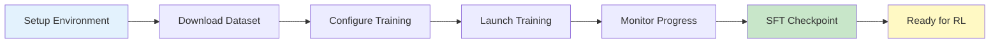

# ARPO SFT Training - Step-by-Step Reproduction Guide

## Table of Contents

1. [Overview](#overview)
2. [Prerequisites](#prerequisites)
3. [Environment Setup](#environment-setup)
4. [Data Preparation](#data-preparation)
5. [Configuration](#configuration)
6. [Training Execution](#training-execution)
7. [Monitoring and Debugging](#monitoring-and-debugging)
8. [Checkpoint Management](#checkpoint-management)
9. [Troubleshooting](#troubleshooting)

---

## Overview

This guide provides a comprehensive, step-by-step walkthrough for reproducing the Supervised Fine-Tuning (SFT) stage of ARPO. The SFT stage prepares a base language model for tool-augmented reasoning by training on multi-turn conversations with tool interactions.

### What You'll Accomplish

- Set up the LLaMA-Factory training environment
- Prepare the ARPO-SFT-54K dataset
- Configure training hyperparameters
- Execute distributed training with DeepSpeed
- Obtain an SFT checkpoint ready for RL training

### Training Workflow



---

## Prerequisites

### Hardware Requirements

**Minimum**:
- 8x NVIDIA GPUs (24GB VRAM each, e.g., RTX 3090/4090)
- 256GB System RAM
- 500GB SSD storage

**Recommended**:
- 8x NVIDIA A100 (40GB/80GB)
- 512GB System RAM
- 1TB NVMe SSD

### Software Requirements

- **OS**: Linux (Ubuntu 20.04/22.04 recommended)
- **CUDA**: 11.8 or 12.1
- **Python**: 3.10
- **Git**: Latest version

### Access Requirements

- HuggingFace account (for model download)
- HuggingFace token with read access
- Sufficient disk space for base model and checkpoints

---

## Environment Setup

### Step 1: Clone the Repository

```bash
# Clone ARPO repository
git clone https://github.com/dongguanting/ARPO
cd ARPO/LLaMA-Factory
```

### Step 2: Create Conda Environment

```bash
# Create a new conda environment
conda create -n sft python=3.10
conda activate sft

# Verify Python version
python --version  # Should show Python 3.10.x
```

### Step 3: Install Dependencies

```bash
# Install PyTorch with CUDA support
# For CUDA 11.8:
pip3 install torch==2.4.0 torchvision torchaudio --index-url https://download.pytorch.org/whl/cu118

# For CUDA 12.1:
pip3 install torch==2.4.0 torchvision torchaudio --index-url https://download.pytorch.org/whl/cu121

# Verify CUDA availability
python -c "import torch; print(f'CUDA available: {torch.cuda.is_available()}, Device count: {torch.cuda.device_count()}')"
# Expected output: CUDA available: True, Device count: 8
```

```bash
# Install LLaMA-Factory requirements
pip install -r requirements.txt

# Key dependencies include:
# - transformers>=4.41.0
# - datasets>=2.16.0
# - accelerate>=0.30.0
# - deepspeed>=0.14.0
# - peft>=0.11.0
# - flash-attn>=2.5.0 (optional, recommended)
```

### Step 4: Install Flash Attention (Optional but Recommended)

```bash
# Install Flash Attention for faster training
pip install flash-attn --no-build-isolation

# This may take 10-15 minutes to compile
# If compilation fails, training will fall back to standard attention
```

### Step 5: Verify Installation

```bash
# Test imports
python -c "import transformers, datasets, deepspeed; print('All imports successful')"

# Check DeepSpeed
ds_report
# This should show CUDA ops compiled successfully
```

---

## Data Preparation

### Step 1: Download Dataset

**Option A: Download from HuggingFace** (Recommended)

```bash
# Install HuggingFace CLI
pip install huggingface_hub

# Login to HuggingFace
huggingface-cli login
# Enter your HuggingFace token when prompted

# Download ARPO-SFT-54K dataset
cd LLaMA-Factory
python -c "
from datasets import load_dataset
dataset = load_dataset('dongguanting/ARPO-SFT-54K')
dataset['train'].to_json('data/final_sft_edition9.json', orient='records', lines=False)
print(f'Downloaded {len(dataset[\"train\"])} samples')
"
```

**Option B: Manual Download**

1. Visit https://huggingface.co/datasets/dongguanting/ARPO-SFT-54K
2. Download `train.json`
3. Place in `LLaMA-Factory/data/final_sft_edition9.json`

### Step 2: Inspect Dataset Format

```bash
# View first sample
python -c "
import json
with open('data/final_sft_edition9.json') as f:
    data = json.load(f)
    print(json.dumps(data[0], indent=2))
"
```

**Expected Format**:
```json
{
  "conversations": [
    {
      "from": "user",
      "value": "What is the derivative of x^2?"
    },
    {
      "from": "assistant",
      "value": "<think>I need to apply the power rule</think><python>from sympy import symbols, diff\nx = symbols('x')\nresult = diff(x**2, x)\nprint(result)</python>"
    },
    {
      "from": "user",
      "value": "<result>2*x</result>"
    },
    {
      "from": "assistant",
      "value": "The derivative is 2x"
    }
  ]
}
```

### Step 3: Register Dataset

Create/update `arpo_train_sft/dataset_info/dataset_info.json`:

```json
{
  "final_sft_edition9": {
    "file_name": "data/final_sft_edition9.json",
    "formatting": "sharegpt",
    "columns": {
      "messages": "conversations"
    },
    "tags": {
      "role_tag": "from",
      "content_tag": "value",
      "user_tag": "user",
      "assistant_tag": "assistant",
      "system_tag": "system"
    }
  }
}
```

### Step 4: Verify Dataset Loading

```bash
# Test dataset loading
cd arpo_train_sft
python -c "
import sys
sys.path.insert(0, '../src')
from llamafactory.data import get_dataset
from llamafactory.hparams import get_train_args

# Mock arguments
class Args:
    dataset_dir = 'dataset_info'
    dataset = 'final_sft_edition9'
    cutoff_len = 15000

dataset = get_dataset(Args(), None, None)
print(f'Loaded {len(dataset)} samples')
print(f'First sample keys: {dataset[0].keys()}')
"
```

---

## Configuration

### Step 1: Download Base Model

```bash
# For Qwen2.5-7B (recommended for 8x24GB GPUs)
huggingface-cli download Qwen/Qwen2.5-7B-Instruct --local-dir models/Qwen2.5-7B-Instruct

# For smaller GPUs, use 3B model:
# huggingface-cli download Qwen/Qwen2.5-3B-Instruct --local-dir models/Qwen2.5-3B-Instruct

# For larger GPUs, use 14B model:
# huggingface-cli download Qwen/Qwen2.5-14B-Instruct --local-dir models/Qwen2.5-14B-Instruct
```

### Step 2: Configure Training Parameters

Create `arpo_train_sft/yaml/sft_config.yaml`:

```yaml
### Model Configuration
model_name_or_path: models/Qwen2.5-7B-Instruct  # Path to downloaded model
trust_remote_code: true

### Training Method
stage: sft                           # Training stage: sft
do_train: true                       # Enable training
finetuning_type: full                # Full parameter fine-tuning (not LoRA)
deepspeed: ../examples/deepspeed/ds_z3_config.json  # DeepSpeed ZeRO-3 config

### Dataset Configuration
dataset_dir: dataset_info            # Dataset metadata directory
dataset: final_sft_edition9          # Dataset name
template: qwen                       # Chat template (qwen/llama/etc.)
cutoff_len: 15000                    # Max sequence length (tokens)
max_samples: 1000000                 # Max samples to use (or all)
overwrite_cache: true                # Rebuild cache on each run
preprocessing_num_workers: 16        # Parallel preprocessing

### Output Configuration
output_dir: checkpoints/qwen2.5-7b-sft  # Checkpoint save directory
logging_steps: 10                    # Log every N steps
save_steps: 2000                     # Save checkpoint every N steps
plot_loss: true                      # Generate loss plot
overwrite_output_dir: true           # Overwrite existing output

### Training Hyperparameters
per_device_train_batch_size: 1       # Batch size per GPU
gradient_accumulation_steps: 2       # Gradient accumulation
learning_rate: 7.0e-6                # Learning rate
num_train_epochs: 3.0                # Number of epochs
lr_scheduler_type: cosine            # LR scheduler (cosine/linear/constant)
warmup_ratio: 0.1                    # Warmup proportion (10% of steps)
bf16: true                           # Use bfloat16 precision
ddp_timeout: 180000000               # Distributed training timeout

### Advanced Options (Optional)
# gradient_checkpointing: true       # Enable gradient checkpointing (saves memory)
# max_grad_norm: 1.0                 # Gradient clipping
# weight_decay: 0.01                 # Weight decay (L2 regularization)
```

### Step 3: Configure DeepSpeed (Optional Customization)

The default DeepSpeed config `examples/deepspeed/ds_z3_config.json` is optimized for most cases. To customize:

```json
{
  "train_batch_size": "auto",
  "train_micro_batch_size_per_gpu": "auto",
  "gradient_accumulation_steps": "auto",
  "gradient_clipping": 1.0,
  "zero_optimization": {
    "stage": 3,
    "offload_optimizer": {
      "device": "cpu",
      "pin_memory": true
    },
    "offload_param": {
      "device": "cpu",
      "pin_memory": true
    },
    "overlap_comm": true,
    "contiguous_gradients": true,
    "reduce_bucket_size": 5e8,
    "stage3_prefetch_bucket_size": 5e8,
    "stage3_param_persistence_threshold": 1e6,
    "stage3_max_live_parameters": 1e9,
    "stage3_max_reuse_distance": 1e9,
    "stage3_gather_16bit_weights_on_model_save": true
  },
  "bf16": {
    "enabled": true
  },
  "steps_per_print": 10,
  "wall_clock_breakdown": false
}
```

**Key Parameters**:
- `stage: 3`: Maximum memory optimization (parameters, gradients, optimizer states sharded)
- `offload_optimizer/param`: Offload to CPU (reduce GPU memory)
- `stage3_gather_16bit_weights_on_model_save`: Save full precision weights

### Step 4: Create Training Launch Script

Create `arpo_train_sft/sft_train.sh`:

```bash
#!/bin/bash

# ============ Environment Setup ============
export CUDA_VISIBLE_DEVICES=0,1,2,3,4,5,6,7  # Use all 8 GPUs
export PYTHONPATH=$(pwd):$PYTHONPATH
export WANDB_DISABLED=true  # Disable Weights & Biases (optional)

# ============ Distributed Training Config ============
NNODES=1                    # Number of nodes
NODE_RANK=0                 # Current node rank (0 for single node)
PROC_PER_NODE=8             # Number of GPUs per node
MASTER_ADDR="127.0.0.1"     # Master node address
MASTER_PORT=29500           # Master port

# ============ Paths ============
SCRIPT_PATH="../src/llamafactory/launcher.py"
CONFIG_FILE="yaml/sft_config.yaml"
OUTPUT_DIR="checkpoints/qwen2.5-7b-sft"

# ============ Create Output Directory ============
mkdir -p $OUTPUT_DIR

# ============ Launch Training ============
echo "Starting SFT training..."
echo "Config: $CONFIG_FILE"
echo "Output: $OUTPUT_DIR"
echo "GPUs: $PROC_PER_NODE"

torchrun \
    --nnodes $NNODES \
    --node_rank $NODE_RANK \
    --nproc_per_node $PROC_PER_NODE \
    --master_addr $MASTER_ADDR \
    --master_port $MASTER_PORT \
    $SCRIPT_PATH $CONFIG_FILE

echo "Training completed!"
```

Make it executable:
```bash
chmod +x arpo_train_sft/sft_train.sh
```

---

## Training Execution

### Step 1: Pre-flight Checks

```bash
# Verify CUDA devices
nvidia-smi
# Ensure all 8 GPUs are visible and not in use

# Check disk space (need ~100GB for checkpoints)
df -h .

# Verify config file exists
ls -lh arpo_train_sft/yaml/sft_config.yaml

# Verify dataset exists
ls -lh data/final_sft_edition9.json
```

### Step 2: Launch Training

```bash
# Navigate to training directory
cd arpo_train_sft

# Launch training
bash sft_train.sh
```

**What Happens Next**:

1. **Initialization** (1-2 minutes):
   - Load configuration
   - Initialize distributed training
   - Download/load base model
   - Load and tokenize dataset

2. **Training Loop** (~6-12 hours for 3 epochs):
   - Forward pass
   - Backward pass
   - Gradient synchronization
   - Optimizer step
   - Periodic checkpointing

3. **Completion**:
   - Save final checkpoint
   - Generate training metrics
   - Create loss plot

### Step 3: Expected Output

**Initialization Logs**:
```
Loading checkpoint shards: 100%|████████| 4/4 [00:10<00:00,  2.51s/it]
trainable params: 7,615,616,000 || all params: 7,615,616,000 || trainable%: 100.0000
Num examples: 54000
Num epochs: 3
Total optimization steps: 10125
```

**Training Logs**:
```
{'loss': 1.2345, 'learning_rate': 6.8e-06, 'epoch': 0.05, 'step': 10}
{'loss': 1.1234, 'learning_rate': 6.9e-06, 'epoch': 0.10, 'step': 20}
...
{'loss': 0.3456, 'learning_rate': 2.1e-06, 'epoch': 2.95, 'step': 10100}
```

**Checkpoint Logs**:
```
Saving model checkpoint to checkpoints/qwen2.5-7b-sft/checkpoint-2000
Saving model checkpoint to checkpoints/qwen2.5-7b-sft/checkpoint-4000
...
```

---

## Monitoring and Debugging

### Real-time Monitoring

**Option 1: Watch Training Log**
```bash
# In a separate terminal
tail -f checkpoints/qwen2.5-7b-sft/training.log
```

**Option 2: Monitor GPU Usage**
```bash
# In a separate terminal
watch -n 1 nvidia-smi
```

**Option 3: Enable Weights & Biases** (Optional)

```bash
# Install wandb
pip install wandb

# Login
wandb login

# Enable in config (remove WANDB_DISABLED from sft_train.sh)
# Add to sft_config.yaml:
# report_to: wandb
# run_name: qwen2.5-7b-sft
```

### Key Metrics to Monitor

1. **Training Loss**: Should decrease steadily (expect 0.3-0.5 final loss)
2. **Learning Rate**: Should follow cosine schedule (peak at warmup end, decay to 0)
3. **GPU Memory**: Should be stable (no OOM errors)
4. **Training Speed**: ~30-60 seconds per step (depends on hardware)

### Debugging Common Issues

**Issue 1: Out of Memory (OOM)**

**Symptoms**:
```
RuntimeError: CUDA out of memory
```

**Solutions**:
```yaml
# Reduce batch size
per_device_train_batch_size: 1  # Already at minimum

# Increase gradient accumulation
gradient_accumulation_steps: 4  # From 2 to 4

# Reduce sequence length
cutoff_len: 10000  # From 15000 to 10000

# Enable gradient checkpointing
gradient_checkpointing: true

# Use DeepSpeed ZeRO-3 with more offloading (already enabled)
```

**Issue 2: Slow Training**

**Symptoms**: Training takes >2 minutes per step

**Solutions**:
```yaml
# Reduce preprocessing workers if CPU-bound
preprocessing_num_workers: 8  # From 16 to 8

# Disable overwrite_cache after first run
overwrite_cache: false

# Ensure Flash Attention is installed
# pip install flash-attn --no-build-isolation
```

**Issue 3: DeepSpeed Initialization Failure**

**Symptoms**:
```
AssertionError: DeepSpeed Zero-3 is not compatible with ...
```

**Solutions**:
```bash
# Reinstall DeepSpeed
pip uninstall deepspeed
pip install deepspeed --no-cache-dir

# Check DeepSpeed ops
ds_report

# Try ZeRO-2 instead
deepspeed: ../examples/deepspeed/ds_z2_config.json
```

**Issue 4: Dataset Loading Error**

**Symptoms**:
```
FileNotFoundError: data/final_sft_edition9.json not found
```

**Solutions**:
```bash
# Check file path
ls -lh data/final_sft_edition9.json

# Verify dataset_info.json
cat arpo_train_sft/dataset_info/dataset_info.json

# Check relative path from config location
cd arpo_train_sft
ls -lh ../data/final_sft_edition9.json
```

---

## Checkpoint Management

### Checkpoint Structure

```
checkpoints/qwen2.5-7b-sft/
├── checkpoint-2000/           # Intermediate checkpoint
│   ├── config.json
│   ├── model.safetensors      # Model weights (sharded if large)
│   ├── optimizer.pt           # Optimizer states
│   ├── scheduler.pt           # LR scheduler state
│   ├── trainer_state.json     # Training metrics
│   └── training_args.bin      # Training arguments
├── checkpoint-4000/
├── ...
└── (final checkpoint files)   # Final model after training
    ├── config.json
    ├── generation_config.json
    ├── model.safetensors
    ├── tokenizer.json
    ├── tokenizer_config.json
    ├── special_tokens_map.json
    ├── train_results.json
    └── training_loss.png      # Loss curve visualization
```

### Resume from Checkpoint

If training is interrupted, resume from the last checkpoint:

```yaml
# Add to sft_config.yaml:
resume_from_checkpoint: checkpoints/qwen2.5-7b-sft/checkpoint-4000
```

Or specify in command line:
```bash
# Modify launcher.py call in sft_train.sh
torchrun ... $SCRIPT_PATH $CONFIG_FILE \
    --resume_from_checkpoint checkpoints/qwen2.5-7b-sft/checkpoint-4000
```

### Checkpoint Selection

**For RL Training**: Use the **final checkpoint** (not intermediate)

```bash
# Verify final checkpoint
ls -lh checkpoints/qwen2.5-7b-sft/model.safetensors

# Use this path in RL training config
actor_rollout_ref.model.path: checkpoints/qwen2.5-7b-sft
```

### Convert to Standard HuggingFace Format (Optional)

If using DeepSpeed ZeRO-3, weights are saved in a special format. Convert for compatibility:

```bash
# Convert DeepSpeed checkpoint to HuggingFace
python -m deepspeed.utils.zero_to_fp32 \
    checkpoints/qwen2.5-7b-sft/checkpoint-10125 \
    checkpoints/qwen2.5-7b-sft-fp32/pytorch_model.bin

# Copy config files
cp checkpoints/qwen2.5-7b-sft/config.json checkpoints/qwen2.5-7b-sft-fp32/
cp checkpoints/qwen2.5-7b-sft/tokenizer* checkpoints/qwen2.5-7b-sft-fp32/
```

---

## Troubleshooting

### Problem: Training Hangs at Initialization

**Cause**: Distributed training communication failure

**Solution**:
```bash
# Check if port is in use
netstat -tuln | grep 29500

# Use different port
MASTER_PORT=29501

# Ensure firewall allows communication
sudo ufw allow 29500/tcp
```

### Problem: "Inconsistent Tensor Sizes" Error

**Cause**: Batch contains sequences exceeding max length

**Solution**:
```yaml
# Increase cutoff_len (may increase memory usage)
cutoff_len: 20000

# Or filter long sequences in dataset preprocessing
# (requires custom data processing)
```

### Problem: Loss Not Decreasing

**Possible Causes**:
1. Learning rate too high/low
2. Data quality issues
3. Model already converged

**Solutions**:
```yaml
# Try different learning rates
learning_rate: 5.0e-6  # Lower
# or
learning_rate: 1.0e-5  # Higher

# Check if loss is already low (<0.5)
# May indicate good starting point

# Inspect training samples for quality
```

### Problem: Checkpoints Taking Too Much Space

**Solutions**:
```bash
# Remove intermediate checkpoints (keep every N)
cd checkpoints/qwen2.5-7b-sft
rm -rf checkpoint-2000 checkpoint-4000  # Keep final only

# Or configure save_strategy
save_strategy: epoch  # Save once per epoch instead of every N steps
```

### Problem: Cannot Load Checkpoint for Inference

**Cause**: Missing tokenizer files

**Solution**:
```bash
# Copy tokenizer from base model
cp models/Qwen2.5-7B-Instruct/tokenizer* checkpoints/qwen2.5-7b-sft/

# Verify all files present
ls checkpoints/qwen2.5-7b-sft/
# Should see: config.json, model.safetensors, tokenizer.json, etc.
```

---

## Validation and Next Steps

### Validate SFT Checkpoint

**Test Loading**:
```python
from transformers import AutoModelForCausalLM, AutoTokenizer

model_path = "checkpoints/qwen2.5-7b-sft"

# Load tokenizer
tokenizer = AutoTokenizer.from_pretrained(model_path, trust_remote_code=True)

# Load model
model = AutoModelForCausalLM.from_pretrained(
    model_path,
    device_map="auto",
    trust_remote_code=True
)

print(f"Model loaded successfully: {model.config.model_type}")
print(f"Vocab size: {len(tokenizer)}")
```

**Test Generation**:
```python
# Test tool-augmented generation
prompt = "What is 123 * 456?"

messages = [{"role": "user", "content": prompt}]
text = tokenizer.apply_chat_template(messages, add_generation_prompt=True, tokenize=False)
inputs = tokenizer(text, return_tensors="pt").to(model.device)

outputs = model.generate(
    **inputs,
    max_new_tokens=512,
    do_sample=False,
    temperature=1.0
)

response = tokenizer.decode(outputs[0], skip_special_tokens=False)
print(response)
```

**Expected Output** (should contain tool usage):
```
<think>I need to multiply 123 and 456</think>
<python>
print(123 * 456)
</python>
```

### Proceed to RL Training

Once SFT is complete and validated:

1. Note the checkpoint path: `checkpoints/qwen2.5-7b-sft`
2. Proceed to RL training guide: `RL_Training_Guide.md`
3. Use SFT checkpoint as `actor_rollout_ref.model.path` in RL config

---

## Appendix: Hyperparameter Tuning Guide

### Memory-Constrained Settings (16GB GPUs)

```yaml
# Use smaller model
model_name_or_path: Qwen/Qwen2.5-3B-Instruct

# Reduce batch size
per_device_train_batch_size: 1
gradient_accumulation_steps: 4

# Reduce sequence length
cutoff_len: 8192

# Enable gradient checkpointing
gradient_checkpointing: true

# Use DeepSpeed ZeRO-3 with full offload
deepspeed: ../examples/deepspeed/ds_z3_offload_config.json
```

### Speed-Optimized Settings (80GB GPUs)

```yaml
# Larger batch size
per_device_train_batch_size: 4
gradient_accumulation_steps: 1

# Longer sequences
cutoff_len: 32768

# Disable offloading
# Use ds_z2_config.json instead of ds_z3_config.json

# Enable Flash Attention
# (install flash-attn)
```

### Quality-Optimized Settings

```yaml
# More epochs
num_train_epochs: 5

# Lower learning rate with more warmup
learning_rate: 5.0e-6
warmup_ratio: 0.15

# Add weight decay
weight_decay: 0.01

# Add dropout (if model supports)
# attention_dropout: 0.1
```

---

## Summary Checklist

Before starting RL training, ensure:

- [ ] SFT training completed without errors
- [ ] Final checkpoint exists: `checkpoints/qwen2.5-7b-sft/model.safetensors`
- [ ] Tokenizer files copied to checkpoint directory
- [ ] Model can be loaded and generates coherent tool-augmented responses
- [ ] Training loss decreased to <0.5
- [ ] Checkpoint path noted for RL config

**Congratulations!** You've successfully completed the SFT stage. Your model is now ready for reinforcement learning training.

---

## Quick Reference Commands

```bash
# Full training pipeline (start to finish)
conda activate sft
cd ARPO/LLaMA-Factory/arpo_train_sft
bash sft_train.sh

# Monitor training
tail -f ../checkpoints/qwen2.5-7b-sft/training.log

# Check GPU usage
watch -n 1 nvidia-smi

# Resume from checkpoint
# Add to sft_config.yaml:
# resume_from_checkpoint: checkpoints/qwen2.5-7b-sft/checkpoint-XXXX

# Test final checkpoint
python -c "from transformers import AutoModelForCausalLM; \
model = AutoModelForCausalLM.from_pretrained('checkpoints/qwen2.5-7b-sft'); \
print('Model loaded successfully')"
```

